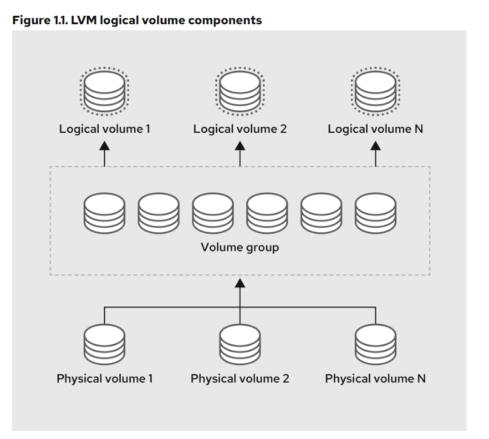
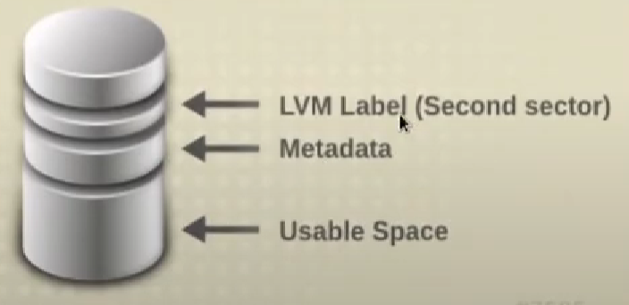

# LVM (Logical Volume Manager)
## pengenalan

- lvm => virtualisasi penyimpanan yang menawarkan pendekatan yang lebih fleksibel kepada administrator 
    - sistem untuk mengelola ruang penyimpanan disk daripada partisi tradisional.
- 1 volume group bisa multiple partiton
- terdiri dari 
    - physical (pv)
    - volume group (vg)
    - logical volume (lv)

- layout

    - LVM Label
    - Metadata
    - Usable Space

- in lvm 1 extends have 4mb
    - but lvm extends can be custom

- function lvm
    - multiple lvm
    - lvm cluster
    - thinly provisioned (jika penyimapanan melebihi maka hanya akan read only)
        - jika ingin bisa write lagi perlu ditambahkan
    - lvm snapshoot
    - cache volume

## create lvm
- untuk create lvm sebenernya bisa tanpa buat partition
    - namun best practice nya perlu dibuat dulu
- add partition with type lvm
```bash
fdisk /dev/vdb
# create partition full
n
- p, (default)

# change the type for lvm
t
- 8e
```

- pv
```bash
pvcreate /dev/vdb1
pvs
```

- vg
```bash
vgcreate vg1 /dev/vdb1 # harus pyhsical volume
vgs # show vg

vgdisplay vg1 # inspect vg1
## VG size => volume group size 
## PE size => extend (default 4mb)
## total PE => jika pe nya 4mb dan vg nya 1gb maka hanya ada PE sebanyak 255
## aloca PE, Free PE (pe yang sudah dan masih bisa dipakai)
```

- lv
```bash
lvcreate -l <PE (extend)> <name_vg> -n <name_lv>
lvcreate -L <size (100Mib)> <name_vg> -n <name_lv>

lvcreate -l 50 vg1 -n lv-1
lvcreate -L 250Mib vg1 -n lv-2

lvs
lsblk
```

- format, and mounting
```bash
# format
mkfs.ext4 /dev/vg1/lv-1
## OR
mkfs.ext4 /dev/mapper/vg1-lv--1

mkfs.xfs -f /dev/vg1/lv-2

# mounting
mount /dev/vg1/lv-1 /home/ariafatah/lv1
mount /dev/vg1/lv-2 /home/ariafatah/lv2
```

# LVM extend
## extend
- create more partiton
- make pvcreate
```bash
pvcreate /dev/vdc1
pvs

# extend vg
vgextend vg1 /dev/vdc1
vgs

# extend lv
lvextend <path_lv> -l <size_pe>
lvextend /dev/vg1/lv-1 -l +50

# resize (ketika di resize maka harus masukin size semuanya bukan pake +)
lvresize <path-lv> -l <size_pe>
lvresize /dev/vg1/lv-1 -l 50

lvresize /dev/vg1/lv-2 -L 500

lvs
```

## resize file system
- untuk memformat type partition yang belum tambah ()
```bash
# ext4, ext3, ext2
resize2fs <path_dev_lv>
resize2fs /dev/vg1/lv-1

# xfs
xfs_growfs <path_dev_lv>
xfs_growfs /dev/vg1/lv-2
```

## add repo for extend
```bash
# pvcreate
# vgextend

# lvextend
lvextend /dev/centos/root -l +100%FREE # add 100% alocation
```

# lvm snapshoot
- minimal harus ada sisa 10% size dari vg nya jika ingin membuat snapshoot
```bash
# create snap
lvcreate -L 10M -s -n lv-1-snap1 vg1/lv-1

## rever / rollback
## harus di unmount terlebih dahulu
umount /home/ariafatah/lv1

lvconvert --merge vg1/lv-1-snap1
# after merge lv-1-snap1 akan hilang karena di merge ke lvmaster yaitu lv-1
```