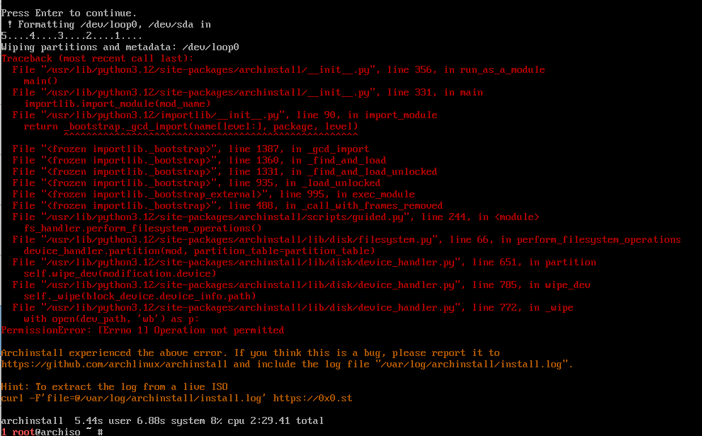

- config ip
```
# wlan

# lan
```

- setup
```
setfont ter-132n
ping archlinux.org
pacman -Sy archlinux-keyring
pacman -Sy archinstall
archinstall

# chroot, before reboot dont forget to remove ur iso
exit
reboot
```

- optional
```
pamcan -Sy firefox libreoffice-fresh flatpak make htop
```

- if ur want install again after error
```
cat /var/log/archinstall/install.log
ls /var/log/archinstall
archinstall --config /var/log/archinstall/user-configuration.json --creds /var/log/archinstall/user-credential.json
```

# error
- PermissionError

- solve: https://github.com/archlinux/archinstall/issues/2396
```
# penyebab
erorr terjadi di virtual box disebabkan saat menyeting partition /dev/loop0

# solve
jangan tambahkan partition /dev/loop0
```