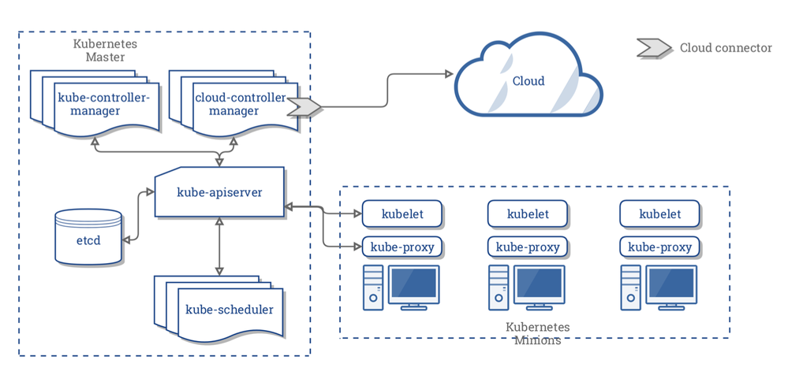
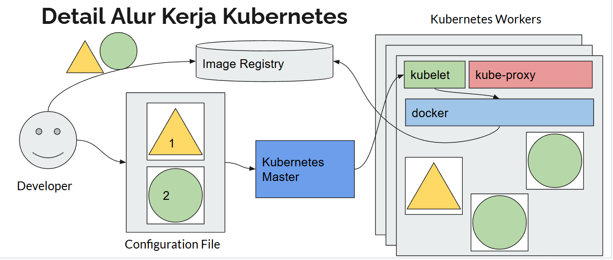

# arsitektur kubernetes

- kubernetes maaster => pihak yang melakukan maanagement
  - kube api-server => bertugas sebagai api yang digunakan untuk berinteraksi dengan kuubernetes cluster
  - etcd => bertugas sebagai database untuk menyimpan kubernetes cluster
  - kube-scheduler => memperhatikan aplikasi yang kita jalankan dan meminta Node untuk menjalankan aplikasi yang kita jalankan
  - kube-controler-manager => melakukan kontrol terhadap kubernetes cluster
  - cloud-controler-maanager => bertugas melakukan kontrol terhadap interaksi terhadap cloud

- kubernetes node (worker)
  - kubelet => berjalan di setiap Node dan bertugas untuk memastikan bahwa aplikasi kita jalan di Node tersebut
  - kubeproxy => berjalaan di setiap Node dan bertugas sebagai proxy terhadap arus network yang masuk ke aplikasi kita dan sebagai load balancer (bisa set firewall juga seperti yang boleh masuk atau tidak)
  - container manager => tugaasnya sebagai container manager. dan mendukung seperti docker, containerd, cri-o

## alur kerja

- sebelum kita membuat configuration file kita akan melakukan push image ke image registery
  - lalu kita akan membuat configuration file (misal buat 1 app kotak, dan 2 app segitiga)
    - yang mengurus kubernetes scedhuler atau controler
  - nanti dikirim ke node yang ditentukan, dan memerintah kubelet untuk me running docker nya