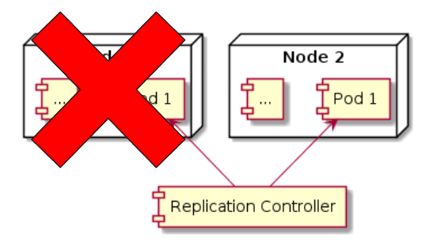

# replication controler
- bertugas untuk memastikan bahwa pod selalu berjalan
  - jika tiba tiba pod mati atau hilang, misal ketika ada node yang mati
    - maka replication controler secara otomatis akan menjalankan pod yang mati atau hilang
  - replication controler biasanya ditugaskan untuk memanage lebih dari 1 pod
  - replication controler akan memastikan jumlah pod berjalan sejumlah yang telah ditentukan
    - jika kurang aakan menambah pod baru
    - jika lebih akan menghapus pod yang sudah ada




## penjelasan
- isi replication controler
  - Label Selector => sebagai penanda pod ()
  - Replica Count => jumlah pod yang harus berjalan (default 3)
  - Pod Template => template yang digunakan untuk menjalan pod ()

## configuration
- template
  ```yaml
  apiVersion: v1
  kind: ReplicationController
  metadata:
    name: nama-replication-controller
    labels:
      label-key1: label-value1 
    annotations:
      annotation-key1: annotation-value1
  spec:
    replicas: 3
    selector:
      label-key1: label-value1
    template:
      metadata:
        name: nama-pod
        labels:
          label-key1: label-value1
      spec:
        containers:
          - name: container-name
            image: image-name
            ports:
              - containerPort: 80
            readinessProbe:
              httpGet:
                path: /health
                port: 80
              initialDelaySeconds: 0
              periodSeconds: 10
              failureThreshold: 3
              successThreshold: 1
              timeoutSeconds: 1
  ```

- example
  ```yaml
  apiVersion: v1
  kind: ReplicationController
  metadata:
    name: nginx-rc
  spec:
    replicas: 3
    selector:
      app: nginx
    template:
      metadata:
        name: nginx
        labels:
          app: nginx
      spec:
        containers:
          - name: nginx
            image: nginx
            ports: 
              - containerPort: 80
  ```

## command
- show 
```bash
kubectl get rc
NAME                   READY   STATUS    RESTARTS         AGE
nginx-rc-bvg5g         1/1     Running   0                108s
nginx-rc-dklh5         1/1     Running   0                108s
nginx-rc-swrsg         1/1     Running   0                108s

# ketika dihapus maka secara otomatis akan di replica sampai menjadi 3 pod lagi
kubectl delete pod 

kubectl get pod
nginx-rc-cxlsq         1/1     Running            0              22s
nginx-rc-dklh5         1/1     Running            0              3m25s
nginx-rc-swrsg         1/1     Running            0              3m25s
```

## menghapus rc
- saat kita menghapus Replication controler, maka secara otomatis pod yang berada di label selector akan ikut terhapus
- jika kita ingin menghapus replication controler, tanpa menghapus pod yang berada pada label selectornya
  - kita bisa tambahkan option --cascade=false (default true hapus pod)
    ```bash
    kubectl delete rc <namerc>
    kubectl delete rc <namerc> --cascade=false
    ```