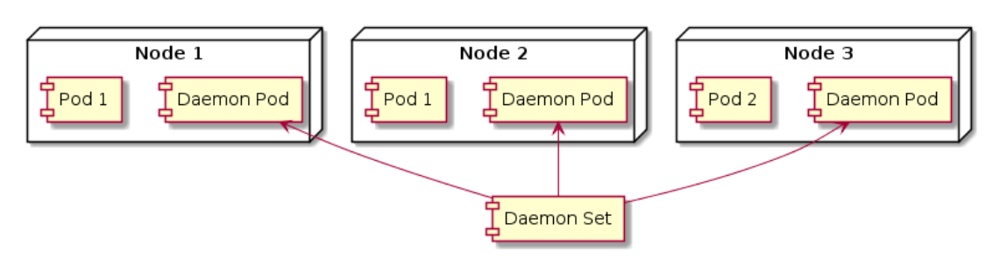

# daemon set

- saat menjalankan rc/rs pod akan dijalankan di node secara random oleh si kubernetes
  - jika kita ingin menjalankan pod di setiap node yang ada di kubernetes,
    - dan tiap pod hanya boleh jalan di 1 node, kita bisa gunakan daemon set
- secara default daemon set akan menjalankan pod di setiap node yang ada di kubernetes cluster 
  - kecuali jika kita meminta hanya jalan di node tertentu

## contoh kasus
- aplikasi untuk monitoring Node
- aplikasi untuk mengambil log di Node

## configuration
- template
  ```yaml
  apiVersion: apps/v1
  kind: DaemonSet
  metadata:
    name: daemon-set-name
  spec:
    selector:
      matchLabels:
        label-key1: label-value1
      matchExpressions:
        - key: label-key1
          operator: In
          values:
            - label-value1
    template:
      metadata:
        name: pod-name
        labels:
          label-key1: label-value1
      spec:
        containers:
          - name: container-name
            image: image-name
            ports:
              - containerPort: 80
  ```

- example
  ```yaml
  apiVersion: apps/v1
  kind: DaemonSet
  metadata:
    name: daemon-nginx
  spec:
    selector:
      matchExpressions:
        - key: app
          operator: In
          values:
            - nginx
            - apache2
    template:
      metadata:
        name: daemon-nginx
        labels:
          app: nginx
      spec:
        containers:
          - name: nginx
            image: nginx
            ports:
              - containerPort: 80
  ```

## command
```bash
kubectl get daemonsets
kubectl delete daemonsetes <nama_daemonsets>
```