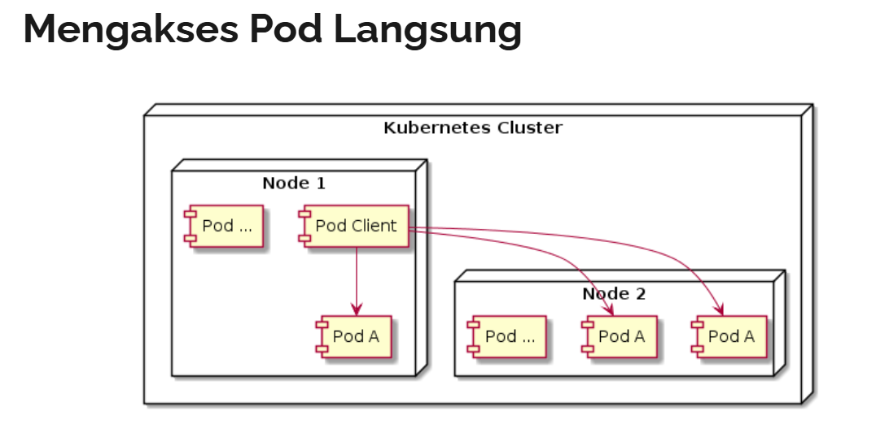
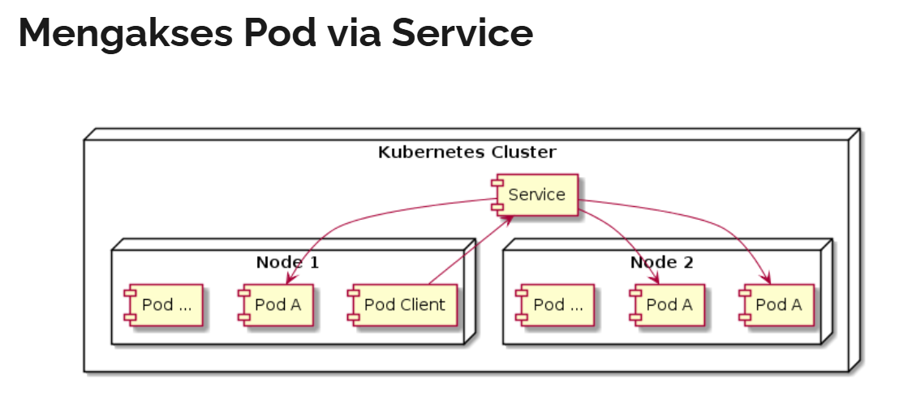

# service
- service => resouce yang ada di kubernetes yang digunakan untuk membuat suatu gerbang untuk mengakses satu atau lebih pod
  - service memiliki ip address dan port, yang tidak pernah berubah selama service itu ada
  - client bisa mengakses service tersebut, dan secara otomatis akan meneruskan pod yang ada di belakang service tersebut
  - dengan begitu client tidak perlu tahu lokasi tiap pod, dan pod bisa bertambah, berkurang, atau berpindah tanpa harus menunggu client




# create service
- service akan mendistribusikan ke pod yang ada di belakang secara seimbang (load balance alg: round robin)
  - service akan menggunakan label selector untuk mengetahui pod mana yang ada dibelakang service tersebut

## command
```sh
kubectl create -f config.yaml
kubectl get service
kubectl delete service <nameservice>

# mengakses service di dalam pod
kubectl exec <name_pod> -it -- /bin/sh
curl http://cluster-ip:port
```

- config
  ```yaml
  apiVersion: v1
  kind: Service
  metadata:
    name: service-name
  spec:
    selector:
      label-key1: label-value1
    ports:
    - port: 8080
      targetPort: 80
  ```

- example
  ```yaml
  apiVersion: apps/v1
  kind: ReplicaSet
  metadata:
    name: nginx
  spec:
    replicas: 3
    selector:
      matchLabels:
        name: nginx
    template:
      metadata:
        name: nginx
        labels:
          name: nginx
      spec:
        containers:
          - name: nginx
            image: nginx
            ports:
              - containerPort: 80

  ---

  apiVersion: v1
  kind: Service
  metadata:
    name: nginx-service
  spec:
    selector:
      name: nginx
    ports:
      - port: 80
        targetPort: 80

  ---

  apiVersion: v1
  kind: Pod
  metadata:
    name: curl
    labels:
      name: curl
  spec:
    containers:
      - name: curl
        image: khannedy/nginx-curl
  ```

# mengakses service
- seandainya aplikasi di pod butuh mengakses pod lain via service, bagaimana cara mengetahui ip address ervice tersebut
  - cara manual dengan membuat service terlebih dahulu, lalu memasukan ke dalam konfigurasi  aplikasinya secara manual
- menggunakan environment variable
  - dengan perintah env
- menggunakan DNS
  - dengan dns
    ```bash
    nama-service.nama-namespace.svc.cluster.local
    ```

## command
```bash
## with env
kubectl exec <name_pod> -it -- env | grep -i NGINX
NGINX_SERVICE_SERVICE_PORT=80
NGINX_SERVICE_SERVICE_HOST=10.98.205.79

curl $NGINX_SERVICE_SERVICE_HOST:$NGINX_SERVICE_SERVICE_PORT

## with dns
nama-service.nama-namespace.svc.cluster.local
curl http://nginx-service.default.svc.cluster.local:80

# show endpoint
kubectl get endpoints
```