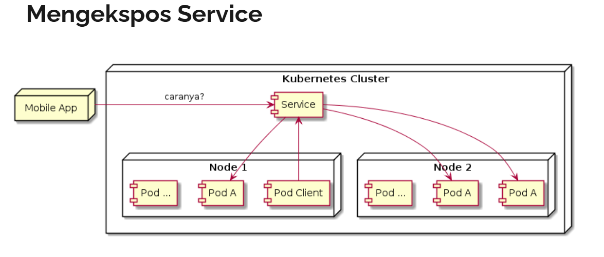

# expose service
- kadang ada kebutuhan kita perlu untuk mengekspos service keluar
  - tujuanya adalah agar aplikasi dari luar kubernetes cluster bisa mengakses pod yang berada di belakang service tersebut

## type service
- ClusterIP => mengekspose service di dalam internal kubernetes cluster
- ExternalName => memetakan service ke externalName (misalnya: example.com)
- NodePort => mengekspose service pada setiap ip node dan port yang sama
  - kita dapat mengakses service dengan tipe ini, dari luar cluster melalui <NodeIP>:<NodePort>
- LoadBalancer => mengekspose service secara external dengan menggunakan LoadBalancer yang disediakan oleh penyedia layanan cloud

- cara mengekspose service
  - dengan menggunakan NodePort, sehingga Node akan membuka port yang akan meneruskan request ke service yang dituju
  - dengan menggunakan LoadBalancer, sehingga service bisa diakses via LoadBalancer, dan Loadbalancer akan meneruskan ke NodePort dan dilanjutkan ke Service
  - dengan menggunakan ingress, dimana ingress adalah resource yang memang ditunjukan untuk mengekspose service,
    - namun ingress hanya beroperasi di http