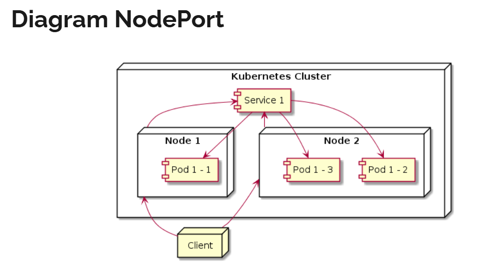

# NodePort


## configuration
```yaml
apiVersion: v1
kind: Service
metadata:
  name: service-name
  labels:
    label-key1: label-value1
spec:
  type: NodePort
  selector:
    label-key1: label-value1
  ports:
    - port: 80
      targetPort: 80
      nodePort: 32767
```

- example
  ```yaml
  apiVersion: apps/v1
  kind: ReplicaSet
  metadata:
    name: nginx
  spec:
    replicas: 3
    selector:
      matchLabels:
        name: nginx
    template:
      metadata:
        name: nginx
        labels:
          name: nginx
      spec:
        containers:
          - name: nginx
            image: nginx
            ports:
              - containerPort: 80

  ---

  apiVersion: v1
  kind: Service
  metadata:
    name: nginx-service
  spec:
    type: NodePort
    selector:
      name: nginx
    ports:
      - port: 80
        targetPort: 80
        nodePort: 30001
  ```

## command
```bash
minikube service <name-service>
minikube service list

kubectl get node -o wide
NAME       STATUS   ROLES           AGE     VERSION   INTERNAL-IP    EXTERNAL-IP   OS-IMAGE             KERNEL-VERSION                       CONTAINER-RUNTIME
minikube   Ready    control-plane   3d10h   v1.31.0   192.168.49.2   <none>        Ubuntu 22.04.4 LTS   5.15.153.1-microsoft-standard-WSL2   docker://27.2.0

kubectl get service
NAME            TYPE        CLUSTER-IP       EXTERNAL-IP   PORT(S)        AGE
kubernetes      ClusterIP   10.96.0.1        <none>        443/TCP        5m18s
nginx-service   NodePort    10.111.219.184   <none>        80:30001/TCP   5m9s

curl 192.168.49.2:30001
```