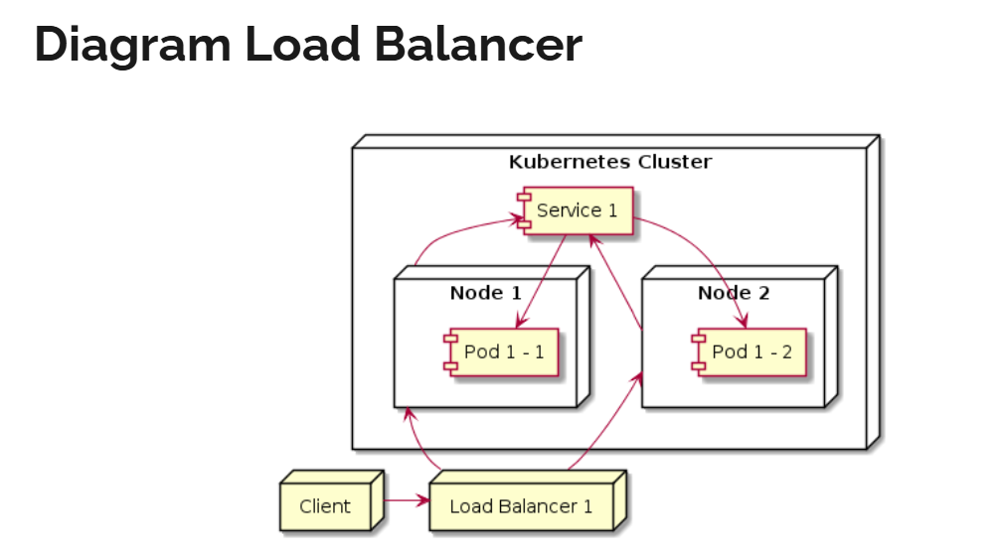
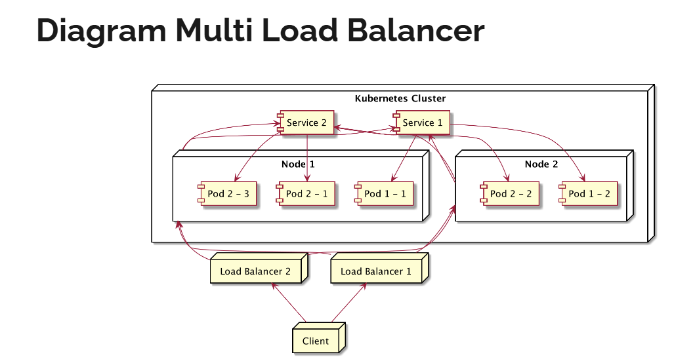

# LoadBalancer
- cloud Provider seperti google cloud, atau aws biasanya memiliki Cloud Load balancer
  - kubernetes bisa menggunakan LoadBalancer bawaan dari cloud provider sebagai cara untuk mengekspose service
  - LoadBalancer akan melakukan load balancer request ke NodePort
  - sayangnya service Loadbalancer ini tidak bisa di test di local seperti menggunakan minikube




## configuration
```yaml
apiVersion: v1
kind: Service
metadata:
  name: service-name
  labels:
    label-key1: label-value1
spec:
  type: LoadBalancer
  selector:
    label-key1: label-value1
  ports:
    - port: 80
      targetPort: 80

# example
apiVersion: apps/v1
kind: ReplicaSet
metadata:
  name: nginx
spec:
  replicas: 3
  selector:
    matchLabels:
      name: nginx
  template:
    metadata:
      name: nginx
      labels:
        name: nginx
    spec:
      containers:
        - name: nginx
          image: nginx
          ports:
            - containerPort: 80

---

apiVersion: v1
kind: Service
metadata:
  name: nginx-service
spec:
  type: LoadBalancer
  selector:
    name: nginx
  ports:
    - port: 80
      targetPort: 80
```

- namun pas dicoba tidak bisa karena minikube tidak support loadbalancer