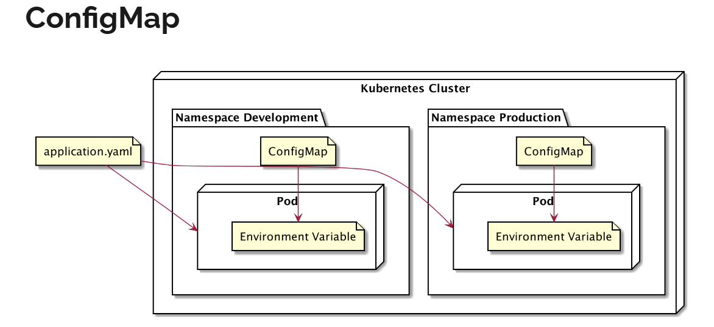

# config map
- saat kita mengharcode konfigurasi environment variable di file yaml kubernetes
  - artinya kita harus siap siap membuat file konfigurasi berbeda beda di tiap environment
  - misal jika kita punya environment production, development, dan qa, kita harus membuat file untuk tiap env
- jika sampai kita lupa mengupdate file konfigurasi maka salah satu kita bisa menggunakan konfigurasi env yang salah

## config map
- kubernetes memiliki kemampuan konfigurasi dalam object bernama configMap
- sederhananya ConfigMap berisi konfigurasi key-value
- aplikasi tidak perlu membaca konfigurasi langsung ke configMap
  - melainkan kubernetes akan mengirimkan konfigurasi di configMap ke dalam environment variable di container



## configuaration
- example
  ```yaml
  apiVersion: v1
  kind: ConfigMap
  data:
    ENV: VALUE
  metadata:
    name: configmap-name

  # example
  apiVersion: v1
  kind: ConfigMap
  metadata:
    name: nodejs-env-config
  data:
    APPLICATION: My Cool Application
    VERSION: 1.0.0

  ---

  apiVersion: apps/v1
  kind: ReplicaSet
  metadata:
    name: nodejs-env
  spec:
    replicas: 3
    selector:
      matchLabels:
        name: nodejs-env
    template:
      metadata:
        name: nodejs-env
        labels:
          name: nodejs-env
      spec:
        containers:
          - name: nodejs-env
            image: khannedy/nodejs-env
            ports:
              - containerPort: 3000
            envFrom:
              - configMapRef:
                  name: nodejs-env-config

  ---

  apiVersion: v1
  kind: Service
  metadata:
    name: nodejs-env-service
  spec:
    type: NodePort
    selector:
      name: nodejs-env
    ports:
      - port: 3000
        targetPort: 3000
        nodePort: 30001
  ```

## command
```bash
kubectl get configmaps
kubectl describe configmap <name_configmap>
kubectl delete configmaps <name_configmap>
```