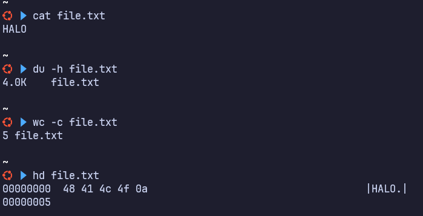

# Data
- encoding
  - hex decimal
  - url encode
  - base64/base32
  - binary
- direpresentasikan byte (8 bit)
  - https://www.asciitable.com/

- example

```bash
HALO
# terdapat 4 huruf yang berarti 4 byte + 1 newline (karakter enter dibelakang)
```
  
## hexdump
- hd (hexdump) => melihat hex pada file
  ```bash
  hd file.txt
  00000000  48 41 4c 4f 0a                                    |HALO.|
  00000005

  OFFSET        hex     0a=newline                             ASCII

  \xnn
    ==
  2 digit : hex   =   1 byte
  ```

- https://www.asciitable.com
  - 0x00 -- 0x20 => non
  - 0x20 -- 0x7e => printablea
  - 0x7e -- oxff => non printable
    - non printable biasanya digunakan data encypt, network atau file random

### praktek
```bash
echo -ne '48414c4f' | xxd -r -p # HALO
# n => berfungsi menonaktifkan newline di akhir
# e => berfungsi agar support format seperti \x01\x0ff

## python2
chr(0x48) + chr(0x41) + chr(0x4c) + chr(0x4f) # HALO
"HALO".encode("hex") # '48414c4f'
'48414c4f'.decode("hex") # 'HALO'
'\x48\x41\x4c\x4f' # 'HALO'

'8090ffad1201'.decode("hex") # '\x80\x90\xff\xad\x12\x01'
  # karena non printable
print '8090ffad1201'.decode("hex") # ����
  # karena non printable adalah ascii yang tidak bisa dibaca (0x7e -- oxff)

open('/dev/urandom').read(16) # non printable juga tidak bisa dibaca
open('/dev/urandom').read(2).encode("hex") # c845 => jika 2 huruf maka jadi 4 hexdump

## python3
b"HALO".hex() # 48414c4f

import codecs
result = codecs.encode(b"HALO", "hex").decode("utf-8")
print(result)
```

## url encoding
- encode saat mengakses halaman web / query
```bash
%48%41%%%4c%4f
a.php?param=%48%41%%%4c%4f # encode

%20 = spasi
%2f = /
```

- with python
```bash
## python2
import urllib
urllib.unquote("%48%41%4c%4f%20%2f") # 'HALO /'
```

## base64 / base32
- mengencode suatu string menjadi string lain yang khusus ascii
  - ciri-ciri base64
    - huruf tidak beraturan(besar kecil), ada nyelip angka, diakhiri dengan "==" (1/2 atau tidak sama sekali)
  - ciri-ciri base32
    - huruf tidak beraturan(huruf besar semua), ada nyelip angka diakhiri dengan "===="

### command
- linux
```bash
echo "Aria Fatah Anom \x01\xff" | base64 # QXJpYSBGYXRhaCBBbm9tIFx4MDFceGZmCg==
  # tidak support hex jika tanpa -e
echo -ne "Aria Fatah Anom \x01\xff" | base64 # QXJpYSBGYXRhaCBBbm9tIAH/
  # support hex

echo -ne "QXJpYSBGYXRhaCBBbm9tIFx4MDFceGZmCg==" | base64 -d # Aria Fatah Anom \x01\xff
echo -ne "QXJpYSBGYXRhaCBBbm9tIAH/" | base64 -d # Aria Fatah Anom �
```

- python2
```bash
## base64
"Aria Fatah Anom \xdd\xff\xad".encode("base64") # QXJpYSBGYXRhaCBBbm9tIN3/rQ==\n
import base64; base64.b64encode("Aria Fatah Anom \xdd\xff\xad") # QXJpYSBGYXRhaCBBbm9tIN3/rQ==

"QXJpYSBGYXRhaCBBbm9tIN3/rQ==".decode("base64") # Aria Fatah Anom \xdd\xff\xad
print "QXJpYSBGYXRhaCBBbm9tIN3/rQ==".decode("base64") # Aria Fatah Anom ���

## base32
base64.b32encode("Aria Fatah Anom \xdd\xff\xad") # 'IFZGSYJAIZQXIYLIEBAW433NEDO77LI='
base64.b32decode('IFZGSYJAIZQXIYLIEBAW433NEDO77LI=') # 'Aria Fatah Anom \xdd\xff\xad'
print base64.b32decode('IFZGSYJAIZQXIYLIEBAW433NEDO77LI=') # Aria Fatah Anom ���
```

## binary
- terdapat 8 bit pada 1 huruf
- misal "HALO" maka binary nya adalah 8x4 = 32
  - "HALO" => 01001000 01000001 01001100 01001111