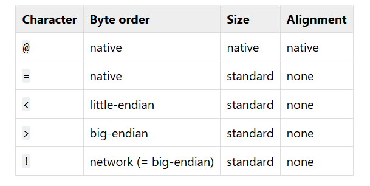

# binary data
## hexdecimal ASCII 
- binear int ke deretean byte
- ketika kita ingin menyimpan file ascii seperti angka
  '313370000' maka nanti file tersebut akan disimpan menggunakan seperti ini '333133333730303030'
  ```bash
  "313370000".encode("hex") # '333133333730303030'
  # # 313370000 => 33 31 33 33 37 30 30 30 30 # 9 byte (Hexadecimal ASCII)
  hex(313370000) # '0x12ada590' (byte)
  ```
  - hex pada angka dimulai dari 0<angka> yang artinya 1 = 31, 7 = 37, 0 = 30

- contoh file
  ```bash
  313370000 => text asli
  33 31 33 33 37 30 30 30 30 => 9 bytes
  
  big_endian    : 12 ad a5 90 => 4 bytes
  little endian : 90 a5 ad 12 => 4 bytes
  ```

- menyusun bit
  - big endian
    - ketika menyusun sesuai urutan # 313370000 = 0x12ada590

  - little endian
    - menyusun seusai urutan kebalikan

### example

```bash
import struct
struct.pack("<I", 313370000) # '\x90\xa5\xad\x12' (little endian)
struct.pack(">I", 313370000) # '\x12\xad\xa5\x90' (big endian)
struct.pack(">Q", 313370000) # '\x00\x00\x00\x00\x12\xad\xa5\x90' (berukuran 8 byte)

struct.unpack("<I", "\x90\xa5\xad\x12") # (313370000,)
struct.unpack(">I", "\x12\xad\xa5\x90")
struct.unpack(">Q", "\x00\x00\x00\x00\x12\xad\xa5\x90")
```

- berguna ketika kita melakukan pwning, binary exploit, network, forensic

## praktek
```bash
open("/home/users/user01/1.txt", "w").write("313370000")
cat 1.txt && echo # 313370000

open("/home/users/user01/2.txt", "w").write(struct.pack("<I", 313370000))
cat 2.txt && echo # ���

open("/home/users/user01/3.txt", "w").write(struct.pack(">I", 313370000))
cat 3.txt && echo # ���

user01@advanaria:~$ hexdump 1.txt
0000000 3133 3333 3037 3030 0030 # string
0000009
user01@advanaria:~$ hexdump 2.txt
0000000 a590 12ad # little endian (90 a5 ad 12) kebalik di tiap byte nya gak tau kenapa
0000004
user01@advanaria:~$ hexdump 3.txt
0000000 ad12 90a5 # big endian (12 ad a5 90)
0000004
```