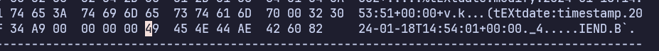

# Forensics, file signature, identification file
- file terbagi menjadi 2
  - file text
    - berisi karakter ASCII (0x20 -- 0x7e)
      - diluar rentang itu berarti file binary
    - karakter spesial seperti new line, tab, vertical tab
    - contoh: text(txt, php, mysql, js, dll) # yang berisi konten nya
  - file binary
    - contoh: gambar(.jpg, .png), audio, program, pdf, dll

## hax editor
  - aplikasi untuk membuka file binary
- command
```bash
sudo apt install bless
bless

sudo apt install hexedit
hexedit <path/file.png>

sudo apt install hexer
hexer <path/file.png>
``` 

## identficasi file
- terdapat 2 cara
  - extension
    - kalo extension bisa kena tipu misal extension png tapi filenya pdf
    - biasa dipake di windows
  - header file (bisa disebut juga magic bytes)
    - biasanya di pake di linux
    - misal
      - jpg diawali JFIF
        - png ada kata yang mengandung png
        - gif diawali GIF87a, GIF89e
      - https://en.wikipedia.org/wiki/List_of_file_signatures

- footer file 
  - footer file png
    

## utility jenis file menggunakan konten
- yang bikin enak ini bisa bekerja meskipun tanpa extension
- command
```bash
file logo.png
# icon.png: PNG image data, 464 x 255, 8-bit/color RGBA, non-interlaced
# nama file, type file, informaasi tambahan

cp icon.png icon
file icon
# icon: PNG image data, 464 x 255, 8-bit/color RGBA, non-interlaced
``` 

- terkadang  jika kita sering melihat isi header dan footer file kita bisa menemukan ciri ciri
  - seperti pada .png yang terdapat hheader IHDR (image header), dan footer IEND (image end)