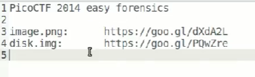

# file carving


## soal 1
- https://goo.gl/dXdA2L

## identification
```bash
# file image.png berisi qr code yang ketika di scan hanya menampilakna tulisan ini bukan jawabanya

file image.png
# image.png: PNG image data, 280 x 280, 8-bit/color RGB, non-interlaced

binwalk image.png
###
DECIMAL       HEXADECIMAL     DESCRIPTION
--------------------------------------------------------------------------------
0             0x0             PNG image, 280 x 280, 8-bit/color RGB, non-interlaced
59            0x3B            Zlib compressed data, default compression
1548          0x60C           7-zip archive data, version 0.3

foremost image.png
# namun ketika dicoba file zip tidak kena

# kita bisa melakukan extract secara manual jika memang ketika di foremost tidak berhasil terkena zipnya
## dengan menghapus hex dari header png sampe footer png yaitu IEND
# lalu kita cek di ghex atau bless (hex editor)
## dan cari IEND dengan fitur find untuk mencari hex end dari image

## jika dilihat zip tersebut dimulai dari offset 0x60c
python
> 0x60c
1548

# jika ingin membaca file dari hex tertentu
## kita bisa gunakan utilty dd

dd bs=1 skip=1548 of=data.7z
# bs => block size = 1 byte
# skip => skip bytes langsung baca offset/bytes 1458 sampai selesai 
# if => input file yang ingin di cek
# of => output file yang ingin di keluarkan data.7z

file data.7z
# data.7z: 7-zip archive data, version 0.3

7z x data.7z # extract
cat flag.txt
EKSi7MktjOpvwesurw0v
```

## soal02
- https://goo.gl/PQwZre

## identification
```bash
file disk.img
# disk.img: DOS/MBR boot sector

binwalk disk.img
###
DECIMAL       HEXADECIMAL     DESCRIPTION
--------------------------------------------------------------------------------
29184         0x7200          JPEG image data, JFIF standard 1.01
121344        0x1DA00         JPEG image data, JFIF standard 1.01
135680        0x21200         JPEG image data, JFIF standard 1.01
313856        0x4CA00         JPEG image data, JFIF standard 1.01
350720        0x55A00         JPEG image data, JFIF standard 1.02

foremost disk.img
###
audit.txt
0:      00000057.jpg          89 KB           29184
1:      00000237.jpg          13 KB          121344
2:      00000265.jpg         172 KB          135680
3:      00000613.jpg          34 KB          313856
4:      00000685.jpg          56 KB          350720

# ternyata di dalam nya ada suatu gambar flag
```

