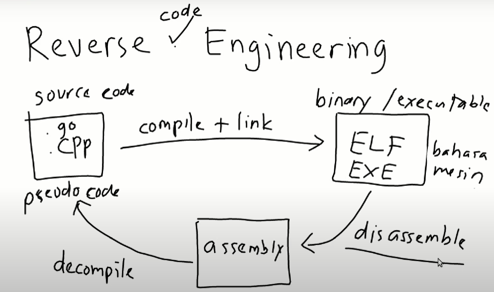
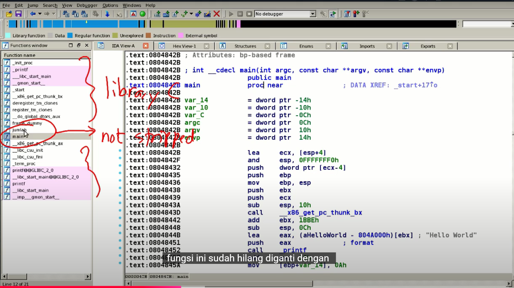
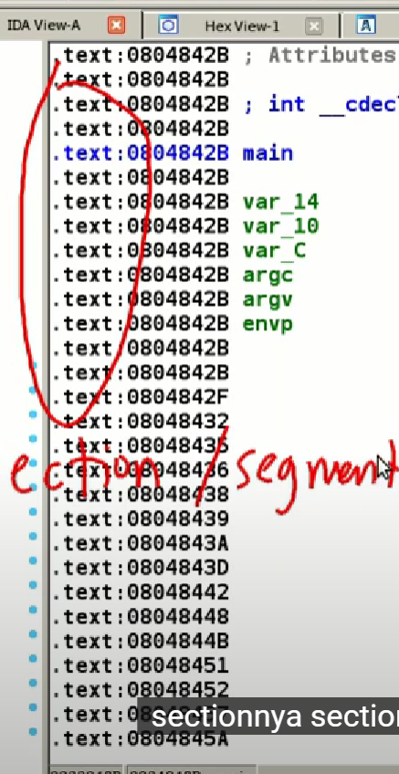
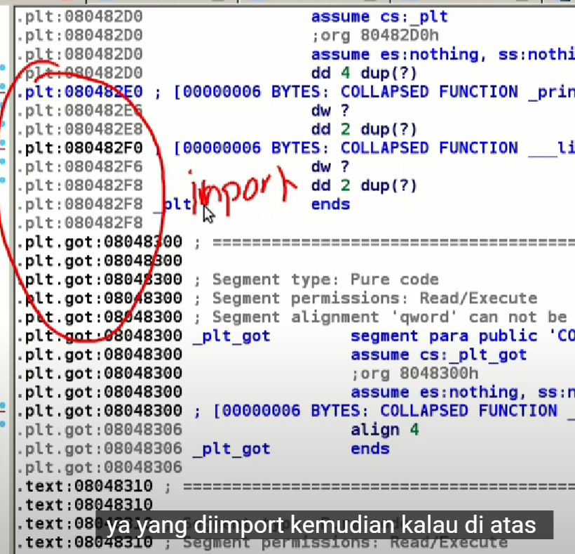

# reverse engineering (reverse code engineering)
## forward engineering
- misal kita punya suatu file source code code progam
  - seperti bahasa c, kemudian nanti akan dilakukan 
    - proses (compile + link) menjadi suatu file binary/executable
  - jika dilinux disebutnya file ELF
  - jika di windows file EXE
  - itulah yang disebut forward engineering

## reverse engineering

- proses sebaliknya
- dari file binary ini kita lakukan proses yang namanya disassemble
  - suatu bahasa assembly

- lalu dari assembly ini di compile untuk mendapatkan pseudo code (source code yang tidak sama persis tapi cukup mirip source code aslinya)
  - dengan proses yang bernama decompile
- jika ada suatu binary/executable yang meminta password kemudian kita lakukan disassemble kemudian kita decompile

- untuk source code yang digunakan tidak selalu bahasa c
  - bisa juga bahasa c++, go (intinya bahasa yang bisa compile)

- kita tujuan adalah memahami cara kerja isi program tanpa kita memiliki source codenya

### tools
- untuk tools nya sendiri untuk reverse engineering
  - untuk proses disassemble, atau decompilenya

1. objdump
   - tools di linux
```bash
objdump -D
# untuk mendapatkan hasil disassemble dari suatu binary
```

2. IDA pro
   - disassemble
   - decompile -> menggunakan plugin hex-Rays
   - debugging

3. radare 2

## pemograman C
```c
#include <stdio.h>

int p = 100;
int testing = 0;

int jumlah(int a, int b) {
  int c = a+b;
  return c;
}

int main(int argc, char **argv) {
  printf("hello world");

  int x,y,z;
  x = 10;
  y = 20;
  z = jumlah(x, y);

  printf("%d\n", z);

  testing = 1337;
  // printf("%d", testing);

  return 0;
}

// %d, %s untuk string, %c untuk char, %f untuk float, %i untuk integer
```

## not stripped
- untuk run
```bash
gcc source-code.c -o file.c # (untuk 64 bit)
gcc source-code.c -no-pie -o file.c # jika di ubuntu versi terbaru

gcc source-code.c file.c -m32 # jika ingin untuk 32 bit

# jika kita lihat di hex editor akan terdapat header .ELF

file out64
# out64: ELF 64-bit LSB pie executable, x86-64, version 1 (SYSV), dynamically linked, interpreter /lib64/ld-linux-x86-64.so.2, BuildID[sha1]=b51b91d9430eb4f0f54150b6b2b56e5aca35667d, for GNU/Linux 3.2.0, not stripped
```

### IDA pro
- ida pro terdapat 2 jenis
  - IDA pro (64 bit)
  - IDA pro (32 bit)


- jika ketika di compile dan di file dan ternyata dia not stripped
- maka nanti hasilnya function nya akan diganti menjadi kode alamat saja


- text: => adalah section / segment
- 080..... adalah addresss
  - biasanya jika 32 bit 0804.... address virtualnya

### segement

- .plt.got => adalah fungsi library yang di import
- .init => adalah segment fungsi entrypoint (yang akan di eksekusi duluan)
- .fini(finish) => eksekusi setelah semuanya selesai (di bagain bawah biasanya)
- .rodata(read only data) => digunakan untuk menyimpan string
- .data => global variable yang terdapat value
- .bss => global variable yang tidak di initialisasi
- .extern(external) => merupakan external function yang dipanggil oleh program
  - seperti printf, dll

- variable local akan hilang setelah di compile
- sedangkan variable global akan muncul di segement .data/.bss

## stripped
- jika binary nya stripped maka functionya hanya berisi alamat saja
- proses strip ini menghilangkan simbol nama function, variable global
  - untuk mengecilkan ukuran filenya
  - namun konsekuensinya nama nama filenya akan hilang

- run
```bash
strip <file_binary>
strip strip32
strip strip64

file strip32
##
strip32: ELF 32-bit LSB pie executable, Intel 80386, version 1 (SYSV), dynamically linked, interpreter /lib/ld-linux.so.2, for GNU/Linux 3.2.0, BuildID[sha1]=ed6fdd7d2e42f686877516f5eaa18fcdaec301ae, stripped

file strip64
##
strip64: ELF 64-bit LSB pie executable, x86-64, version 1 (SYSV), dynamically linked, interpreter /lib64/ld-linux-x86-64.so.2, BuildID[sha1]=b51b91d9430eb4f0f54150b6b2b56e5aca35667d, for GNU/Linux 3.2.0, stripped
```

### IDA 
- jika kita melihat menggunakan IDA pro maka nama variablenya akan tidak terbaca namun kita bisa mengubah nya agar memudahkan dalam mencari tahu