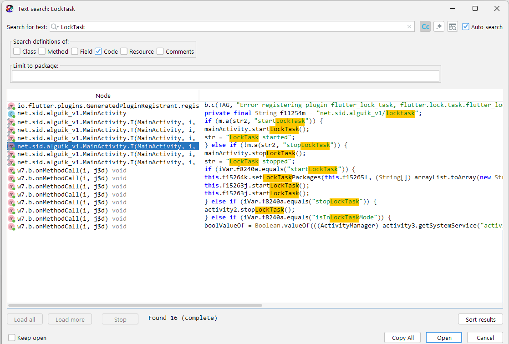
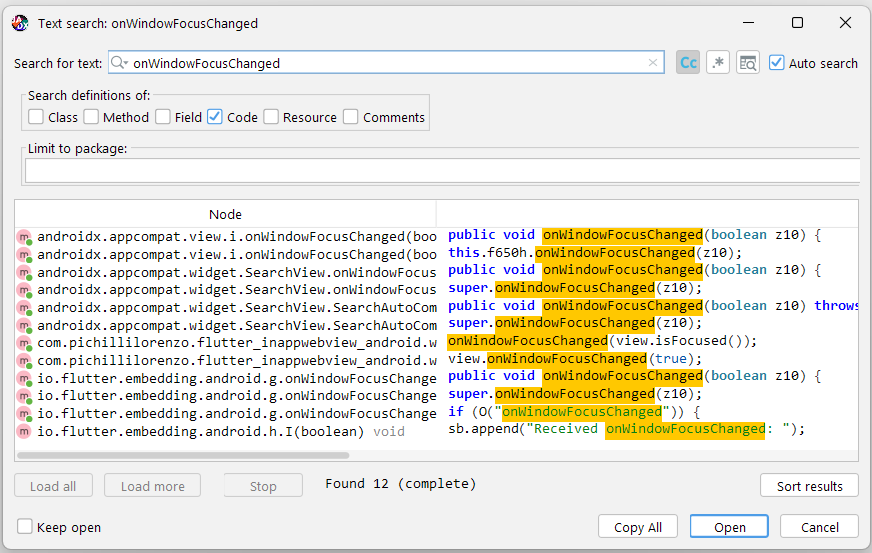
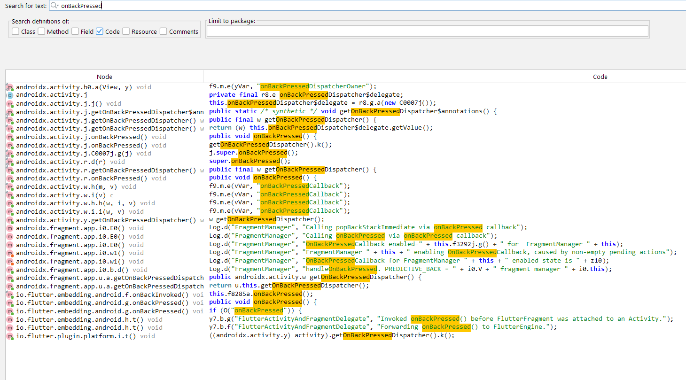
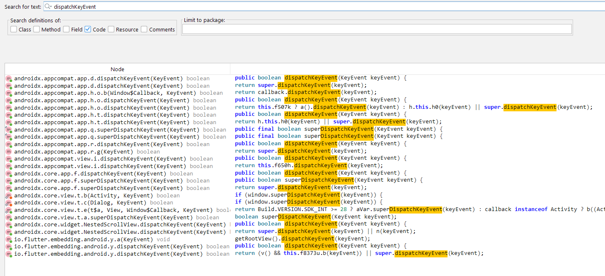

## Alguik Kiosk Mode Analysis

### Instalasi dan Setup Tools

```bash
scoop bucket add java     # untuk openjdk
scoop bucket add extras

scoop install openjdk
scoop install jadx

jadx-gui
```

### Koneksi dan Penarikan APK dari Device

```bash
scrcpy -tcpip

adb -s <ip:port> shell dumpsys activity | findstr mResumedActivity
adb logcat

# Menarik APK dari device
adb shell pm path net.sid.alguik_v1
adb pull /data/app/xxx/base.apk alguik.apk
```

### Langkah Eksplorasi APK

1. Buka `jadx-gui`
2. Klik `File > Open`
3. Pilih `base.apk` dari folder Downloads
4. Tunggu hingga proses decompile selesai
5. Eksplor folder seperti `MainActivity`, `WebView`, `LockTask`, dsb

### Target Pencarian Kode:

* `KioskMode`, `LockTask`, `setLockTaskEnabled`
* `onWindowFocusChanged`, `onBackPressed`, `dispatchKeyEvent`
* `WebView.setWebChromeClient()` → indikasi exam browser
* `System.exit(0)` atau mekanisme force close

### AndroidManifest.xml

Cari permission:

* `SYSTEM_ALERT_WINDOW`
* `DISABLE_KEYGUARD`
* `RECEIVE_BOOT_COMPLETED`
* `FOREGROUND_SERVICE`

---

### 📌 Kode Kunci LockTask

```java
if (str2.equals("startLockTask")) {
    mainActivity.startLockTask(); // 🔐 Mulai kunci aplikasi
} else if (str2.equals("stopLockTask")) {
    mainActivity.stopLockTask(); // 🔓 Lepas kunci aplikasi
}
```

```java
setLockTaskPackages(...) // 🧩 Daftarkan package untuk LockTask
```

➡️ Aplikasi ini:

* Memaksa masuk LockTask mode
* Hanya izinkan package tertentu
* Memblokir gesture back, recent app, dsb



---

### 🔍 onWindowFocusChanged(boolean hasFocus)

Method ini dipanggil ketika aplikasi mendapat atau kehilangan fokus.

```java
super.onWindowFocusChanged(z10);
view.onWindowFocusChanged(true);
```

➡️ Sering dipakai untuk:

* Deteksi user mencoba keluar
* Kembalikan fokus ke app



---

### 🔙 Fungsi onBackPressed()

```java
@Override
public void onBackPressed() {
    // kosong atau diblok → user tidak bisa keluar
}
```

➡️ Dipakai untuk blokir tombol "kembali".



---

### ⌨️ dispatchKeyEvent(KeyEvent event)

Method ini intercept semua tombol fisik seperti:

* Tombol Back
* Volume
* Power

```java
@Override
public boolean dispatchKeyEvent(KeyEvent event) {
    if (this.f8373u.b(event)) return true;
    return super.dispatchKeyEvent(event);
}
```

➡️ Ini artinya:

* Tombol dicek secara custom
* Jika disaring (return true), maka event tidak lanjut



---

### 🔐 Kesimpulan:

Aplikasi Alguik ini menggunakan beberapa teknik Android Kiosk Mode:

* `startLockTask()` dan `setLockTaskPackages()`
* Memblokir tombol dan gesture keluar
* Override `onBackPressed()`, `dispatchKeyEvent()` dan `onWindowFocusChanged()` untuk menahan user tetap di aplikasi
* Memanfaatkan permission dan event lifecycle untuk memaksa aplikasi tetap aktif dan fokus
