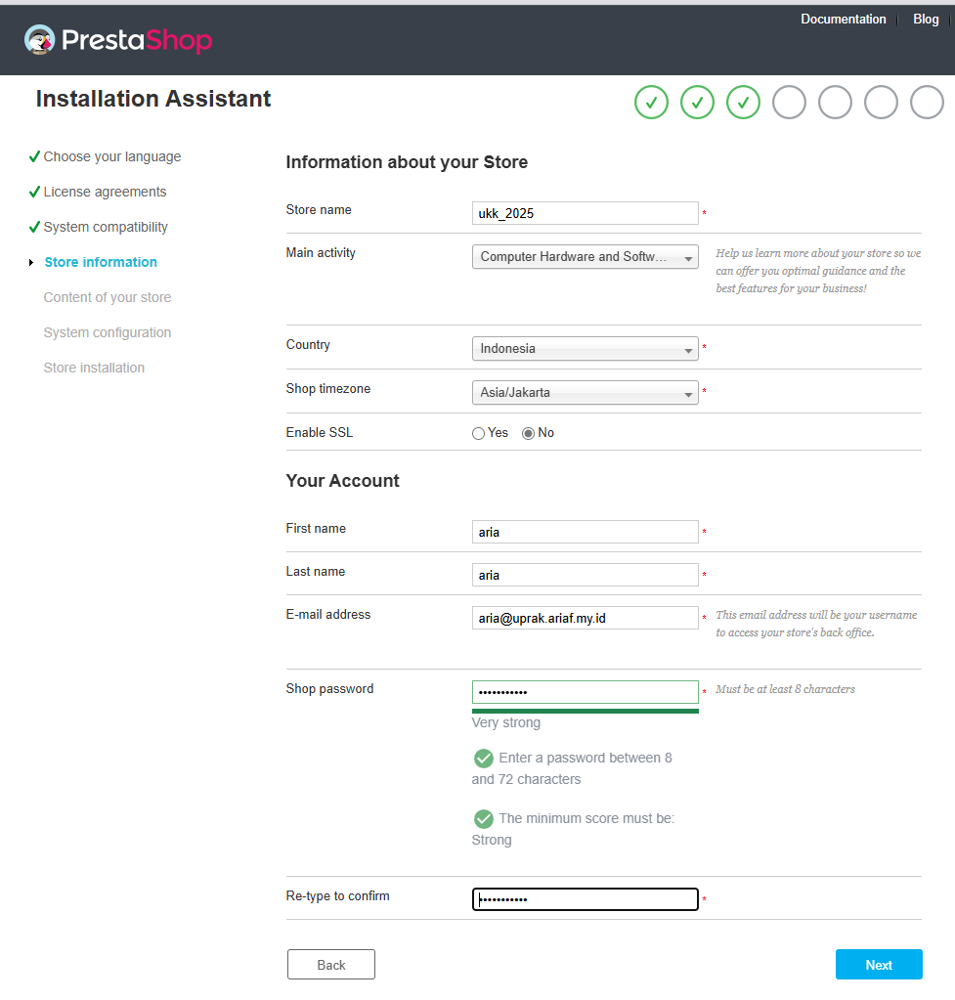

# PrestaShop
- [https://github.com/PrestaShop/PrestaShop](https://github.com/PrestaShop/PrestaShop)

## setup
```bash
# apt install apache2 mysql-server php
apt-get update && apt-get upgrade
apt install apache2 mysql-server php unzip -y

cd /var/www/html
rm ./*

wget https://github.com/PrestaShop/PrestaShop/releases/download/8.2.0/prestashop_8.2.0.zip
unzip prestashop_8.2.0.zip
rm index.php
unzip prestashop.zip

chown -R www-data:www-data /var/www/html/
chmod -R 755 /var/www/html/

/etc/init.d/apache2 restart
systemctl restart apache2

# buka web dan masukan ipnya
apt install php-zip php-xml -y

# lalu setup jika sudah di system compitable lihat apa saja yang kurang
apt install php-curl php-gd php-mysql php-intl php-mbstring -y

sudo a2enmod rewrite
/etc/init.d/apache2 restart
# systemctl restart apache2
```

## store information

- aria:ariaf.my.id

## setup database (host)
```bash
/etc/init.d/mysql start
# if error  error while loading shared libraries: libicuuc.so.66: cannot open shared object file: Permission

mysql_secure_installation
mysql -u root -p
# skip error
CREATE USER 'aria'@'%' IDENTIFIED BY '123';
GRANT ALL PRIVILEGES ON *.* TO 'aria'@'%' WITH GRANT OPTION;
FLUSH PRIVILEGES;

CREATE DATABASES prestashop;
# use prestashop;
```

<!-- ## setup database (docker)
```bash
docker run -d \
  --name mysql_container \
  -e MYSQL_ROOT_PASSWORD=strongpassword \
  -e MYSQL_DATABASE=prestashop \
  -e MYSQL_USER=prestashop_user \
  -e MYSQL_PASSWORD=securepassword \
  -p 3306:3306 \
  --restart unless-stopped \
  mysql:latest
``` -->

## after install
```bash
rm -rf install/
mv admin admin-ukk2025
```