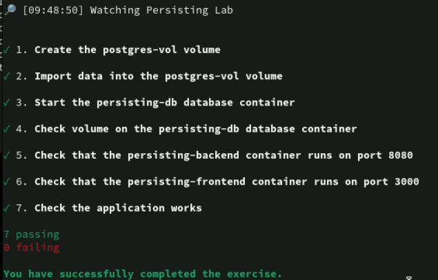
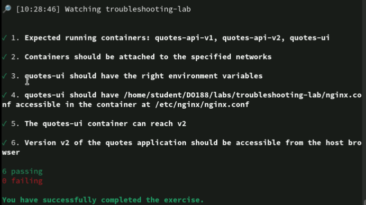
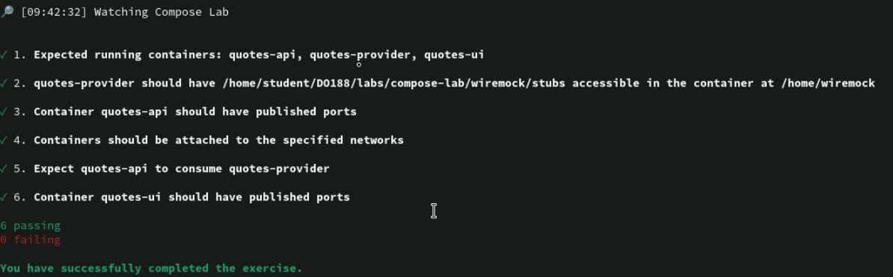

# 1
## pengenalan container
- container menggunakan fitur kernel linux
    - misalnya seperti namespace dan Grup Kontrol (cgroups)
- OCI (Open Container Initiative)
    - organisasi tata kelola yang mendefinisikan standar untuk membuat dan menjalankan kontainer.

### image
- runc
- podman
- CRI-O

## pengenalan kubernetes, openshift
- kubernetes
    - adalah platform orkestrasi kontainer sumber terbuka yang mengotomatiskan penerapan, penskalaan, dan pengelolaan aplikasi dalam kontainer. 
    - Ini menyediakan fungsionalitas inti yang diperlukan untuk mengelola kontainer, tetapi memerlukan alat dan integrasi tambahan untuk membuat platform siap perusahaan yang lengkap

- openshift adalah distribusi kubernetes
    - dan artinya kita memiliki kubernetes dalam openshift
    - OpenShift, yang dikembangkan oleh Red Hat, adalah platform aplikasi tingkat perusahaan komprehensif yang dibangun di atas Kubernetes.
        - Ini termasuk Kubernetes sebagai intinya tetapi menambahkan banyak fitur dan alat tambahan untuk memberikan solusi yang lebih lengkap untuk mengelola aplikasi dalam kontainer
 
### Kubernetes dan Red Hat OpenShift Container Platform (RHOCP)
- feature RHOCP
    - Remote management
    - Multiple tenants
    - Increased security
    - Continuous integration
    - Continuous development

# 2
## ansible (opsional)
- example
```bash
git clone repo_ansible.git
cd repo_ansible
ansible-playbook playbook.yaml
```

## podman
- Podman adalah alat open source yang dapat Anda gunakan untuk mengelola kontainer Anda secara lokal. Dengan Podman, Anda dapat menemukan, menjalankan, membangun, atau menerapkan kontainer OCI (Open Container Initiative) dan citra kontainer.
    - Secara default, Podman tidak memiliki daemon. Daemon adalah proses yang selalu berjalan dan siap untuk menerima permintaan yang masuk. Beberapa alat kontainer lainnya menggunakan daemon untuk memproksikan permintaan, yang membawa satu titik kegagalan. Selain itu, daemon mungkin memerlukan hak istimewa yang ditingkatkan, yang merupakan masalah keamanan. Podman berinteraksi langsung dengan kontainer, gambar, dan registri tanpa daemon.
    - Podman hadir dalam bentuk antarmuka baris perintah (CLI), yang didukung untuk beberapa sistem operasi. Bersama dengan CLI, Podman menyediakan dua cara tambahan untuk berinteraksi dengan kontainer Anda dan mengotomatiskan proses, RESTful API dan aplikasi desktop yang disebut Podman Desktop.

### command
```bash
podman -v
podman pull registry.redhat.io/rhel7/rhel:7.9
podman images
podman run registry.redhat.io/rhel7/rhel:7.9 echo 'Red Hat' # run foregond
podman ps
podman ps -a
podman run --rm registry.redhat.io/rhel7/rhel:7.9 echo 'Red Hat' ## run and remove
podman ps --all --format=json
podman run -d # detecth (latar belakang)
podman run -p 8081:80 # port forwading
podman run -e NAME='Red Hat' # environment

podman-desktop
```

### lab 1
```bash
podman run --rm registry.ocp4.example.com:8443/ubi8/ubi-minimal:8.5 \
 echo 'Hello Red Hat'
podman run --rm -e GREET=Hello -e NAME='Red Hat' \
 registry.ocp4.example.com:8443/ubi8/ubi-minimal:8.5 printenv GREET NAME
podman run --rm -p 8080:8080 \
 registry.ocp4.example.com:8443/ubi8/httpd-24

```

## podman network
- need 2 network
    - UI networok
    - API network

- ketika kita membuat container tanpa menambahkan network maka otomatis akan menggunakan podman
    - network podman tidak mengaktifkan dns secara default
    - sedangkan network yang telah dibuat memiliki dns

### command
```bash
podman network create
podman network ls
podman network inspect
podman network rm
podman network prune
podman network connect # Menghubungkan kontainer yang sudah berjalan ke atau dari jaringan yang ada. Atau, sambungkan kontainer ke jaringan Podman

podman network create example-net
podman run -d --name my-container --net example-net container-image:latest
podman run -d --name double-connector --net postgres-net,redis-net\
 container-image:latest # multiple net
podman network connect example-net my-container

podman port -a
podman port <name_container>
```

### lab 2
```bash
grep -i listen podman-info-times/app/main.go
cat podman-info-times/Containerfile
podman network inspect podman | jq .[].subnets
podman network inspect podman | jq .[].dns_enabled

podman network create cities
podman run --name times-app \
--network cities -p 8080:8080 -d \
registry.ocp4.example.com:8443/redhattraining/podman-info-times:v0.1

podman inspect times-app \
-f '{{.NetworkSettings.Networks.cities.IPAddress}}'
podman inspect times-app | jq .[].NetworkSettings.Networks.cities
```

## podman access

- Proses Push ke Registry
    - Saat kamu push sebuah container image, registry akan menyimpan setiap layer secara terpisah berdasarkan hash uniknya. Jika ada layer yang sudah ada (misalnya foo dan bar), registry tidak akan menyimpannya lagi, hanya layer baru seperti baz atau zab yang akan diunggah. Ini membantu menghemat ruang penyimpanan.
- Proses Pull dari Registry
    - Ketika kamu pull sebuah image, Docker akan memeriksa apakah layer tertentu seperti foo dan bar sudah ada di sistem lokal. Jika iya, Docker hanya akan mengambil layer yang belum ada, seperti zab. Ini membuat proses pull menjadi lebih cepat dan efisien.
- Lower Dir : directory full lokasi path nya
- MergerDir : directory default ketika buat image
- UpperDir : directory yang sudah diubah
- WorkDir : directory yang sedang digunakan

- command
```bash
# interaksi dengan container terakhir bisa gunakan -l
podman exec httpd cat /etc/httpd/conf/httpd.conf
podman exec -l cat /etc/httpd/conf/httpd.conf
podman exec -il /bin/bash # interactive sessions
ls
pwd

podman exec -it -l /bin/bash  interactive with tty
bash-4.4$ ls

podman cp [options] [container:]source_path [container:]destination_path
podman cp a3bd6c81092e:/tmp/logs . # cp to host
podman cp nginx.conf nginx:/etc/nginx # cp from host to container
podman cp nginx-test:/etc/nginx/nginx.conf nginx-proxy:/etc/nginx # cp from container to container
```

## lab 3
```bash
podman run --name nginx -d -p 8080:8080 \
  registry.ocp4.example.com:8443/redhattraining/podman-nginx-helloworld
podman cp nginx:/var/log/nginx/error.log error.log
podman cp nginx:/etc/nginx/nginx.conf . # copy to host
podman cp nginx.conf nginx:/etc/nginx # copy to container
podman exec nginx nginx -s reload
```

## lab 4
```bash
podman run --name httpd -d -p \
 8080:8080 registry.ocp4.example.com:8443/ubi8/httpd-24

podman ps
podman inspect --format='{{.State.Status}}' httpd # running
podman inspect --format='{{.State.Running}}' httpd # true

podman stop -l
podman inspect --format='{{.State.Status}}' httpd # exited
podman inspect --format='{{.State.Running}}' httpd # false

podman restart httpd # running

podman rm httpd
podman rm httpd --force # remove meskipun running status

podman run --name greeter -d \
registry.ocp4.example.com:8443/redhattraining/podman-greeter-ignore-sigterm

podman stop greeter --time=5
podman restart greeter
podman kill greeter # kill signal jadi restartnya tidak akan jadi
```

## lab soal

```bash
lab start basics-podman
podman cp basics-podman-secret:/etc/secret-file solution ~/DO188/labs/basics-podman/solution

podman network create lab-net
podman run -d --name basics-podman-server \
--net lab-net -p 8080:8080 registry.ocp4.example.com:8443/ubi8/httpd-24

podman cp index.html basics-podman-server:/var/www/html/

podman run -d --name basics-podman-client \
--net lab-net registry.ocp4.example.com:8443/ubi8/httpd-24

podman network inspect lab-net
podman exec basics-podman-client \
curl -s http://basics-podman-server:8080 && echo
```

# 3
## registery
```bash
# registry.redhat.io/ubi8/ubi:8.6
# registery / namespace / image : tag
# registry.access.redhat.com: requires no authentication
# registry.redhat.io: requires authentication

vi /etc/containers/registries.conf 

# list
unqualified-search-registries == ['registry.redhat.io', 'docker.io']

# block
[[registry]]
location="docker.io"
blocked=true
```

## skopoe
```bash
skopeo inspect \
 docker://registry.access.redhat.com/ubi9/nodejs-18

skopeo copy \
 docker://registry.access.redhat.com/ubi9/nodejs-18 \
 dir:/var/lib/images/nodejs-18

podman login

cat ${XDG_RUNTIME_DIR}/containers/auth.json
```

## lab 1
```bash
lab start images-basics
oc login -u admin -p redhatocp \
    https://api.ocp4.example.com:6443
podman login -u $(oc whoami) -p $(oc whoami -t) \
  default-route-openshift-image-registry.apps.ocp4.example.com
podman login -u developer -p developer \
  registry.ocp4.example.com:8443

RHOCP_REGISTRY="default-route-openshift-image-registry.apps.ocp4.example.com"
skopeo copy --dest-tls-verify=false \
  docker://${RHOCP_REGISTRY}/default/python:3.9-ubi8 \
  docker://registry.ocp4.example.com:8443/developer/python:3.9-ubi8

## In a web browser, navigate to https://registry.ocp4.example.com:8443 and log in with the user developer and password developer.
## Type developer in the Filter Repositories field, then click the developer/python repository.
## Click the Settings icon at the bottom of the page. Scroll to the Repository Visibility settings and click Make Public. Then, click OK.

podman logout --all  
podman pull \
  registry.ocp4.example.com:8443/developer/python:3.9-ubi8

podman run --rm \
  registry.ocp4.example.com:8443/developer/python:3.9-ubi8 python3 --version
```

## manage images
```bash
# [<image repository>/<namespace>/]<image name>[:<tag>]
podman image tag LOCAL_IMAGE:TAG LOCAL_IMAGE:NEW_TAG
podman search nginx

podman build --file Containerfile \
  --tag quay.io/YOUR_QUAY_USER/IMAGE_NAME:TAG

podman push quay.io/YOUR_QUAY_USER/IMAGE_NAME:TAG

podman image rm -f REGISTRY/NAMESPACE/IMAGE_NAME:TAG
podman rmi --all
podman image rm --all

podman image prune
podman image prune -a
podman image prune -af

podman export -o mytarfile.tar fb601b05cd3b
podman import mytarfle.tar httpdcustom:2.4
```

## lab 2
```bash
lab start images-managing

podman image ls --format "{{.Repository}}"
cd ~/DO188/labs/images-managing

podman build -f Containerfile -t \
simple-server

podman image ls
podman run -d \
  -p 8080:8000 \
  --name http-server \
  simple-server

curl http://localhost:8080/hello.html
podman image inspect simple-server \
  --format="{{.Config.Cmd}}"

podman image tag simple-server \
simple-server:0.1

podman image ls
podman image rm simple-server
podman image rm simple-server:0.1
podman image rm -f simple-server:0.1
```

## lab soal

```bash
lab start images-lab
podman login -u developer -p developer registry.ocp4.example.com:8443
cd ~/DO188/labs/images-lab
podman build --file Containerfile --tag registry.ocp4.example.com:8443/developer/images-lab
podman push registry.ocp4.example.com:8443/developer/images-lab

podman tag registry.ocp4.example.com:8443/developer/images-lab registry.ocp4.example.com:8443/developer/images-lab:grue
podman push registry.ocp4.example.com:8443/developer/images-lab:grue

podman run -d --name images-lab -p 8080:8080 images-lab:grue
curl localhost:8080
lab finish images-lab
```

# 4
## Containerfile
```bash
# This is a comment line 1
FROM        registry.redhat.io/ubi8/ubi:8.6 2
LABEL       description="This is a custom httpd container image" 3
RUN         yum install -y httpd 4
EXPOSE      80 5
ENV         LogLevel "info" 6
ADD         http://someserver.com/filename.pdf /var/www/html 7
COPY        ./src/   /var/www/html/ 8
USER        apache 9
ENTRYPOINT  ["/usr/sbin/httpd"] 10
CMD         ["-D", "FOREGROUND"] 

man Containerfile
```

## lab 1
```bash
lab start custom-containerfiles
cat > Containerfile << EOF
FROM registry.ocp4.example.com:8443/redhattraining/podman-ubi9.2

COPY . /tmp/hello-server
RUN dnf module enable -y nodejs:18
RUN dnf install -y nodejs
RUN cd /tmp/hello-server && npm install

CMD cd /tmp/hello-server && npm start
EOF

podman build -t hello-server:bad .
podman run -d --rm --name hello-bad -p 3000:3000 hello-server:bad
curl http://localhost:3000/greet ;echo
podman image tree hello-server:bad

cat > Containerfile << EOF
FROM registry.ocp4.example.com:8443/redhattraining/podman-ubi9.2

WORKDIR /tmp/hello-server
COPY ..
RUN dnf module enable -y nodejs:18 && \
    dnf install -y nodejs && \
    npm install 

CMD npm start
EOF

podman build -t hello-server:better .
podman image tree hello-server:better
podman run -d --rm --name hello-better -p 3000:3000 hello-server:better
curl http://localhost:3000/greet ;echo
podman stop hello-better

cat > Containerfile << EOF
FROM registry.ocp4.example.com:8443/ubi9/nodejs-18:1

LABEL org.opencontainers.image.authors="aria"
LABEL com.example.environment="production"
LABEL com.example.version="0.0.1"

ENV SERVER_PORT=3000
ENV NODE_ENV="production"

EXPOSE $SERVER_PORT

WORKDIR /opt/app-root/src
COPY . .
RUN npm install

CMD npm start
EOF

podman build -t hello-server:best .
podman inspect hello-server:best -f '{{.Config.Env}}'
podman run -d --rm --name hello-best -p 3000:3000 hello-server:best

curl http://localhost:3000/greet ;echo
podman stop hello-best
```

## advance container file
```bash
# ENV
ENV DB_HOST="database.example.com"

##
from os import environ
DB_HOST = environ.get('DB_HOST')
# Connect to the database at DB_HOST...
##

## ARG
ARG key[=default value]

ARG VERSION="1.16.8" \
    BIN_DIR=/usr/local/bin/
ENV VERSION=${VERSION} \
    BIN_DIR=${BIN_DIR}
RUN curl "https://dl.example.io/${VERSION}/example-linux-amd64" \
        -o ${BIN_DIR}/example

ARG VERSION \
    BIN_DIR
ENV VERSION=${VERSION:-1.16.8} \
    BIN_DIR=${BIN_DIR:-/usr/local/bin/}
RUN curl "https://dl.example.io/${VERSION}/example-linux-amd64" \
        -o ${BIN_DIR}/example

## volume
FROM registry.redhat.io/rhel9/postgresql-13:1
VOLUME /var/lib/pgsql/data

podman volume prune
podman volume create VOLUME_NAME
podman volume ls --format="{{.Name}}\t{{.Mountpoint}}"

## ENTRYPOINT
FROM registry.access.redhat.com/ubi8/ubi-minimal:8.5
ENTRYPOINT ["echo", "Hello"]

podman run my-image # Hello
podman run my-image Red Hat # Hello Red Hat

## CMD
FROM registry.access.redhat.com/ubi8/ubi-minimal:8.5
CMD ["echo", "Hello", "Red Hat"]

podman run my-image # Hello Red Hat
podman run my-image whoami # root

## BOTH (ENTRYPOINT AND CMD)
FROM registry.access.redhat.com/ubi8/ubi-minimal:8.5
ENTRYPOINT ["echo", "Hello"]
CMD ["Red", "Hat"]

podman run my-image # Hello Red Hat
podman run my-image Podman # Hello Podman

## Text Array
ENTRYPOINT ["executable", "param1", ... "paramN"]

# string form
CMD executable param1 ... paramN 

FROM registry.access.redhat.com/ubi8/ubi-minimal:8.5
LABEL GREETING="World"
ENTRYPOINT echo Hello "${GREETING}"

podman run my-image # Hello
podman run my-image env # Hello
podman run --entrypoint env my-image
# show env

## Podman Secrets
echo "R3d4ht123" > dbsecretfile
podman secret create dbsecret dbsecretfile
printf "R3d4ht123" | podman secret create dbsecret2 - # 875a1e46fa64639756968c644

podman secret ls
podman secret rm dbsecret2
podman run -it --secret dbsecret --name myapp registry.access.redhat.com/ubi8/ubi /bin/bash

cat /run/secrets/dbsecret

## multistage build
# First stage
FROM registry.access.redhat.com/ubi8/nodejs-14:1 as builder 1
COPY ./ /opt/app-root/src/
RUN npm install
RUN npm run build 2

# Second stage
FROM registry.access.redhat.com/ubi8/nginx-120 3
COPY --from=builder /opt/app-root/src/ /usr/share/nginx/html 

podman build -t localhost/not-squashed .
podman build --squash -t localhost/squashed .
podman build --squash-all -t localhost/squashed-all .

podman images --format="{{.Names}}\t{{.Size}}"
[localhost/not-squashed:latest]  419 MB 1
[localhost/squashed:latest]      419 MB 2
[localhost/squashed-all:latest]  394 MB 3
```

## lab 2
```bash
lab start custom-advanced

cd ~/DO188/labs/custom-advanced
cat > Containerfile << EOF
FROM registry.ocp4.example.com:8443/redhattraining/podman-random-numbers as generator
RUN python3 random_generator.py

FROM registry.ocp4.example.com:8443/ubi8/python-38:1-96

ENV FILE="/redhat/materials/numbers.txt"
USER default
WORKDIR /redhat

COPY --from=generator --chown=default /app/numbers.txt materials/numbers.txt
COPY main.py .

VOLUME /redhat/materials

CMD python3 main.py
EOF

podman build -t redhat-local/custom-advanced .
podman run --rm --name=custom-advanced redhat-local/custom-advanced
# Current content: ['17 72 97 8 32 15 63 97 57']
```

## rootles podman
```bash
# change contaienr user
## default
podman run registry.access.redhat.com/ubi9/ubi id

FROM registry.access.redhat.com/ubi9/ubi
CMD ["python3", "-m", "http.server"]

FROM registry.access.redhat.com/ubi9/ubi

## mengubah user (keamanan)
RUN adduser \
   --no-create-home \
   --system \
   --shell /usr/sbin/nologin \
   python-server

USER python-server

CMD ["python3", "-m", "http.server"]

## pemetaan user
cat /etc/subuid /etc/subgid
# student:100000:65536
# student:100000:65536

sudo usermod --add-subuids 100000-165535 --add-subgids 100000-165535 student
grep student /etc/subuid /etc/subgid
# /etc/subuid:student:100000:65536
# /etc/subgid:student:100000:65536

podman run -it registry.access.redhat.com/ubi9/ubi bash
podman top e6116477c5c9 huser user
# HUSER       USER
# 1000        root

cat /proc/self/uid_map /proc/self/gid_map

## no rootles
sudo sysctl -w "net.ipv4.ip_unprivileged_port_start=79"
sudo sysctl -w "net.ipv4.ping_group_range=0 2000000"
```

## lab 3
```bash
lab start custom-rootless

cd $HOME/DO188/labs/custom-rootless/gitea
podman build -t gitea .

sudo !! # previous command with sudo
sudo $HOME/DO188/labs/custom-rootless/ids.sh # menghapus mapping id pengguna

podman run --rm -p 3030:3030 gitea # error
sudo podman run --name root-gitea -p 3030:3030 --rm gitea # work
sudo podman exec root-gitea cat /proc/self/uid_map /proc/self/gid_map # root (not secure)
# 0          0 4294967295
# 0          0 4294967295

sudo podman stop root-gitea
sudo touch /etc/{subuid,subgid}

sudo usermod --add-subuids 100000-165536 --add-subgids 100000-165536 student
cat /etc/subuid /etc/subgid

podman run --rm -p 3030:3030 --name gitea gitea # error
podman system migrate # migrasi rentang id pengguna

podman run --name gitea --rm -p 3030:3030 gitea # work
podman stop gitea

sudo $HOME/DO188/labs/custom-rootless/ids.sh
lab finish custom-rootless
```

## lab soal

```bash
lab start custom-lab

cd ~/DO188/labs/custom-lab
npm install; npm start

# add  "RUN ./gen_certificates.sh" in first stage build

# dibagian bawah tambahnakn ENV, WORKDIR, USER, RUN, ENTRYPOINT

# add ENV
## ENV TLS_PORT=8443 \
##  HTTP_PORT=8080
##  CERTS_PATH="/etc/pki/tls/private/certs"
# add WORKDIR /app in Containerfile
# add USER student in Containerfile
# add "RUN npm install --omit=dev"
# add ENTRYPOINT npm start

podman build . -t localhost/podman-qr-app
podman run --name custom-lab -p 8080:8080 -p 8443:8443 localhost/podman-qr-app
```

# 5
## Persisting Data
```bash
FROM registry.access.redhat.com/ubi8/ubi-minimal

RUN microdnf install httpd
RUN microdnf clean all
RUN rm -rf /var/cache/yum

CMD httpd -DFOREGROUND

## commnad
--volume /path/on/host:/path/in/container:OPTIONS
--mount type=TYPE,source=/path/on/host,destination=/path/in/container

## example
podman run -p 8080:8080 --volume  /www:/var/www/html:ro \
  registry.access.redhat.com/ubi8/httpd-24:latest

# selinux
podman run -p 8080:8080 --volume /www:/var/www/html \
  registry.access.redhat.com/ubi8/httpd-24:latest

podman unshare ls -l /www/
# -rw-rw-r--. 1 root root 21 Jul 12 15:21 index.html
podman unshare ls -ld /www/
# drwxrwxr-x. 1 root root 20 Jul 12 15:21 /www/
ls -Zd /www
# system_u:object_r:default_t:s0:c228,c359 /www
# The output shows the SELinux context label system_u:object_r:default_t:s0:c228,c359, which has the default_t type. A container must have the container_file_t SELinux type to have access to the bind mount. SELinux is out of scope for this course.
ls -Zd /www
# system_u:object_r:container_file_t:s0:c240,c717 /www

## storing data with volume
podman volume create http-data
podman volume inspect http-data
podman run -p 8080:8080 --volume  http-data:/var/www/html \
  registry.access.redhat.com/ubi8/httpd-24:latest
podman volume import http_data web_data.tar.gz
podman volume export http_data --output web_data.tar.gz

## storing data with a tmpsfs mount
podman run -e POSTGRESQL_ADMIN_PASSWORD=redhat --network lab-net \
  --mount  type=tmpfs,tmpfs-size=512M,destination=/var/lib/pgsql/data \
  registry.redhat.io/rhel9/postgresql-13:1
```

## lab 1
```bash
lab start persisting-mounting

cat ~/DO188/labs/persisting-mounting/podman-python-server/Containerfile
cp ~/DO188/labs/persisting-mounting/index.html ~/www
podman run -ti --rm --name podman-server \
  --volume ~/www:/server:Z -p 8000:8000 \
  registry.ocp4.example.com:8443/redhattraining/podman-python-server
# open localhost:8000 (error)
# logs: 10.0.2.100 - - [28/Jun/2022 13:21:08] code 404, message No permission to list directory

podman unshare ls -l --directory ~/www
# drwxrwx---. 1 root root 20 Jun 28 14:56 /home/student/www
podman run --rm registry.ocp4.example.com:8443/redhattraining/podman-python-server id
# uid=994(python-server) gid=994(python-server) groups=994(python-server)
podman unshare chgrp -R 994 ~/www
podman unshare ls -ln --directory ~/www
# drwxrwx---. 1 0 994 20 Jun 28 14:56 /home/student/www
# open localhost:8000 (success)

podman volume create html-vol
cd ~/DO188/labs/persisting-mounting
podman volume import html-vol index.tar.gz
podman run -ti --rm --name podman-server -p 8000:8000 \
   --mount 'type=volume,source=html-vol,destination=/server,ro' \
   registry.ocp4.example.com:8443/redhattraining/podman-python-server
# open localhost:8000
```

## Working with Databases
```bash
# import database data
podman cp SQL_FILE TARGET_DB_CONTAINER:CONTAINER_PATH
podman exec -it DATABASE_CONTAINER \
  psql -U DATABASE_USER -d DATABASE_NAME \
       -f CONTAINER_PATH/SQL_FILE
podman run -it --rm \
  -e PGPASSWORD=DATABASE_PASSWORD \
  -v ./SQL_FILE:/tmp/SQL_FILE:Z \
  --network DATABASE_NETWORK \
  registry.redhat.io/rhel8/postgresql-12:1-113 \
  psql -U DATABASE_USER -h DATABASE_CONTAINER \
       -d DATABASE_NAME -f /tmp/SQL_FILE
# export database data
podman exec POSTGRESQL_CONTAINER \
  pg_dump -Fc DATABASE -f BACKUP_DUMP
```

## lab 2
```bash
lab start persisting-databases
podman run -it --rm \
  --name persisting-pg12 \
  -e POSTGRESQL_USER=backend \
  -e POSTGRESQL_PASSWORD=secret_pass \
  -e POSTGRESQL_DATABASE=rpi-store \
  -v ~/DO188/labs/persisting-databases:/opt/app-root/src/postgresql-start:Z \
  registry.ocp4.example.com:8443/rhel8/postgresql-12:1-113
podman exec -it persisting-pg12 \
  psql -d rpi-store -c "select * from model"

## 2
podman run -it --rm \
  --name persisting-pg12 \
  -e POSTGRESQL_USER=backend \
  -e POSTGRESQL_PASSWORD=secret_pass \
  -e POSTGRESQL_DATABASE=rpi-store \
  registry.ocp4.example.com:8443/rhel8/postgresql-12:1-113
podman exec -it persisting-pg12 \
  psql -d rpi-store -c "select * from model"

## 3
podman volume create rpi-store-data
podman run -d \
  --name persisting-pg12 \
  -e POSTGRESQL_USER=backend \
  -e POSTGRESQL_PASSWORD=secret_pass \
  -e POSTGRESQL_DATABASE=rpi-store \
  -v rpi-store-data:/var/lib/pgsql/data \
  -v ~/DO188/labs/persisting-databases:/opt/app-root/src/postgresql-start:Z \
  registry.ocp4.example.com:8443/rhel8/postgresql-12:1-113
podman exec -it persisting-pg12 \
  psql -d rpi-store -c "select * from model"

## 4
podman rm -f persisting-pg12
podman run -d \
  --name persisting-pg12 \
  -e POSTGRESQL_USER=backend \
  -e POSTGRESQL_PASSWORD=secret_pass \
  -e POSTGRESQL_DATABASE=rpi-store \
  -v rpi-store-data:/var/lib/pgsql/data \
  registry.ocp4.example.com:8443/rhel8/postgresql-12:1-113
podman exec -it persisting-pg12 \
  psql -d rpi-store -c "select * from model"

## 5
podman network create persisting-network
podman rm -f persisting-pg12
podman run -d \
  --name persisting-pg12 \
  -e POSTGRESQL_USER=backend \
  -e POSTGRESQL_PASSWORD=secret_pass \
  -e POSTGRESQL_DATABASE=rpi-store \
  -v rpi-store-data:/var/lib/pgsql/data \
  --network persisting-network \
  registry.ocp4.example.com:8443/rhel8/postgresql-12:1-113
podman run -d \
  --name persisting-pgadmin \
  -e PGADMIN_SETUP_EMAIL=gls@example.com \
  -e PGADMIN_SETUP_PASSWORD=pga_secret_pass \
  -p 5050:5050 \
  --network persisting-network \
  registry.ocp4.example.com:8443/crunchydata/crunchy-pgadmin4:ubi8-4.30-1

## login in localhost:5050 with cred gls@example.com:pga_secret_pass
## Connect to the persisting-pg12 database container by clicking Add New Server.
## In the General tab, set rpi-store as the name.
## Switch to the Connection tab. Fill the form with the following data and leave the rest of the fields with their default values.
# Hostname/address	persisting-pg12
# Username	backend
# Password	secret_pass
## View the data in the model table to verify the pgAdmin access to the rpi-store database in the persisting-pg12 container. 
## Select the model table by clicking Servers > rpi-store > Databases > rpi-store > Schemas > public > Tables > model.
## Click the View Data icon to verify that pgAdmin queries the data in the persisting-pg12 container.

# 6
podman exec persisting-pg12 \
  pg_dump -Fc rpi-store -f /tmp/db_dump
podman cp persisting-pg12:/tmp/db_dump /tmp/db_dump
podman stop persisting-pg12
podman volume create rpi-store-data-pg13
podman run -d \
  --name persisting-pg13 \
  -e POSTGRESQL_USER=backend \
  -e POSTGRESQL_PASSWORD=secret_pass \
  -e POSTGRESQL_DATABASE=rpi-store \
  -v rpi-store-data-pg13:/var/lib/pgsql/data \
  registry.ocp4.example.com:8443/rhel9/postgresql-13:1
podman cp /tmp/db_dump persisting-pg13:/tmp/db_dump
podman exec persisting-pg13 \
  pg_restore -d rpi-store /tmp/db_dump
podman exec -it persisting-pg13 \
  psql -d rpi-store -c "select * from model"
podman rm persisting-pg12
podman volume rm rpi-store-data
```

## lab soal

```bash
lab start persisting-lab

podman volume create postgres-vol
podman volume import postgres-vol ~/DO188/labs/persisting-lab/postgres-vol.tar.gz

podman network create persisting-net
podman run --name persisting-db -d \
 --net persisting-net -e POSTGRESQL_USER=user \
 -e POSTGRESQL_PASSWORD=pass -e POSTGRESQL_DATABASE=db \
 --mount='type=volume,src=postgres-vol,dst=/var/lib/pgsql/data' \
 registry.ocp4.example.com:8443/rhel9/postgresql-13:1

podman run --name persisting-backend -d \
 -e DB_HOST=persisting-db -p 8080:8080 --net persisting-net \
 registry.ocp4.example.com:8443/redhattraining/podman-urlshortener-backend

podman run --name persisting-frontend -d \
  --net persisting-net -p 3000:8080 \
  registry.ocp4.example.com:8443/redhattraining/podman-urlshortener-frontend
```

# 6
## container loging and trobleshooting
```bash
podman ps -a
podman logs CONTAINER
podman port CONTAINER
podman exec -it CONTAINER ss -pant
podman inspect CONTAINER --format '{{.State.Pid}}'
sudo nsenter -n -t CONTAINER_PID ss -pant
podman inspect CONTAINER --format='{{.NetworkSettings.Networks}}'
# map[network_name:0xc000a825a0]
podman network inspect NETWORK

## podman event
podman info --format {{.Host.EventLogger}}
# journald
podman events --stream=false
podman events --filter event=create --filter type=container --stream=false
podman events --since 5m --stream=false
```

## lab 1
```bash
lab start troubleshooting-logging
podman logs smart-home-api
podman inspect \
  smart-home-db --format='{{.NetworkSettings.Networks}}'
podman network inspect troubleshooting-lab
podman inspect \
  smart-home-api --format='{{.NetworkSettings.Networks}}'
podman rm smart-home-api

podman run -d --rm \
  --name smart-home-api \
  -e DB_HOST=smart-home-db -e DB_USER=backend -e DB_PASSWORD=secret_pass \
  -p 8080:8080 \
  --network troubleshooting-lab \
  registry.ocp4.example.com:8443/redhattraining/smart-home-api:1.0
podman logs smart-home-api

podman exec \
  smart-home-api curl http://localhost:8080/device/1

# curl: (7) Failed to connect to localhost port 8080: Connection refused
podman exec smart-home-api ss -pant
# Error: crun: executable file ss not found in $PATH: No such file or directory: OCI runtime attempted to invoke a command that was not found

podman inspect smart-home-api --format '{{.State.Pid}}'
sudo nsenter -t 2809 -n ss -pant
# tcp   LISTEN 0      2048       0.0.0.0:8000       0.0.0.0:*  users: "uvicorn",pid=76641,fd=23

podman exec -it \
  smart-home-api curl  http://localhost:8000/device/1
curl http://localhost:8080/device/1
podman stop smart-home-api
podman run -d --rm \
  --name smart-home-api \
  -e DB_HOST=smart-home-db -e DB_USER=backend -e DB_PASSWORD=secret_pass \
  -p 8080:8000 \
  --network troubleshooting-lab \
  registry.ocp4.example.com:8443/redhattraining/smart-home-api:1.0
curl http://localhost:8080/device/1
# {"id":1,"name":"Bedroom Light","state":"on"}%

cd ~/DO188/labs/troubleshooting-logging/smart-home
podman stop smart-home-api

podman run -d --rm \
  --name smart-home-api \
  -e DB_HOST=smart-home-db -e DB_USER=backend -e DB_PASSWORD=secret_pass \
  -p 8080:8000 \
  --network troubleshooting-lab \
  -v ./automations.yaml:/config/automations.yaml \
  registry.ocp4.example.com:8443/redhattraining/smart-home-api:1.0
curl http://localhost:8080/automations
podman exec \
  smart-home-api ls -l /config/
ls -Z automations.yaml
# system_u:object_r:user_home_t:s0 automations.yaml
podman stop smart-home-api

podman run -d --rm \
  --name smart-home-api \
  -e DB_HOST=smart-home-db -e DB_USER=backend -e DB_PASSWORD=secret_pass \
  -p 8080:8000 \
  --network troubleshooting-lab \
  -v ./automations.yaml:/config/automations.yaml:Z \
  registry.ocp4.example.com:8443/redhattraining/smart-home-api:1.0

ls -Z automations.yaml
# system_u:object_r:container_file_t:s0:c539,c793 automations.yaml
curl http://localhost:8080/automations
# [{"automation":"Turn garage lights ON when presence detected","wait_for_trigger":[{"platform":"event","event_type":"PRESENCE_DETECTED"},{"platform":"state","device_id":1,"to":"on","for":60}]}]
```

## lab 2
```bash
lab start troubleshooting-debugging
cd ~/DO188/labs/troubleshooting-debugging/nodebug
cat package.json

podman build -t nodebug .
podman run -d --rm \
  --name nodebug -p 8080:8080 -p 9229:9229 \
  nodebug npm run debug
podman logs nodebug

codium .
# Yes, I trust the authors.
# Click Run → Add configuration to open a selection menu, and then click Node.js.
{
    "version": "0.2.0",
    "configurations": [
        {
            "type": "node",
            "request": "attach",
            "name": "Debug Nodebug",
            "port": 9229,
            "address": "localhost",
            "localRoot": "${workspaceFolder}",
            "remoteRoot": "/"
        }
    ]
}

# run start debug
curl localhost:8080/echo?message=hello
curl localhost:8080/snacks?search=apple
# sorry, we don't have any apples :(

app.get("/snacks", (req, res) => {
  const search == req.query.search;
  const available_snacks == ["apple", "cheese", "cracker", "lunchmeat", "olive"];
  for (const snack of available_snacks) {
    if (snack ==== search) {
      res.send(`yes, we have ${search}s!\n`);
      return;
    }
  }
  res.send(`sorry, we don't have any ${search}s :(\n`);
});
'

curl localhost:8080/snacks?search=apple
podman stop nodebug
npm install
podman run -d --rm \
  --name nodebug -p 8080:8080 -p 9229:9229 \
  -v .:/opt/app-root/src:Z \
  nodebug npm run debug
podman rm -f nodebug
rm -r node_modules
podman build -t nodebug .
podman run -d --rm \
  --name nodebug -p 8080:8080 nodebug
curl localhost:8080/snacks?search=apple
# yes, we have apples!
```

## lab soal

```bash
lab start troubleshooting-lab

podman ps -a
podman logs quotes-ui
# nginx: [emerg] host not found in upstream "quotes-api-v1" in /etc/nginx/nginx.conf:45
podman inspect quotes-api-v1 --format='{{.NetworkSettings.Networks}}'
# map[troubleshooting-lab:0xc000a825a0]
podman inspect quotes-ui --format='{{.NetworkSettings.Networks}}' # map[]

podman rm quotes-ui
podman run -d \
  --name quotes-ui -p 3000:8080 \
  -e QUOTES_API_VERSION=v2 \
  --net troubleshooting-lab \
  registry.ocp4.example.com:8443/redhattraining/quotes-ui-versioning:1.0
podman ps

podman exec quotes-ui curl -s http://localhost:8080/api/v1/quotes # v1 work
podman exec quotes-ui curl -s http://localhost:8080/api/v2/quotes # v2 bad gateway

podman logs quotes-api-v2
# port:                         8081

podman exec quotes-ui cat /etc/nginx/nginx.conf
#  proxy_pass http://quotes-api-v2:8080;

cat ~/DO188/labs/troubleshooting-lab/nginx.conf
podman rm -f quotes-ui
podman run -d \
  --name quotes-ui \
  -p 3000:8080 \
  -e QUOTES_API_VERSION=v2 \
  --net troubleshooting-lab \
  -v ~/DO188/labs/troubleshooting-lab/nginx.conf:/etc/nginx/nginx.conf:Z \
  registry.ocp4.example.com:8443/redhattraining/quotes-ui-versioning:1.0
```

# 7
## Multi-container (Compose)
```bash
# yaml
services:
  orders: 1
    image: quay.io/user/python-app 2
    ports:
    - 3030:8080 3
    environment:
      ACCOUNTS_SERVICE: http://accounts 4

# 1 Declare the orders container.
# 2 Use the python-app container image.
# 3 Bind the 3030 port on your host machine to the 8080 port within the container.
# 4 Pass the ACCOUNTS_SERVICE environment variable to the application.

# Podman Pods
# Podman introduced an alternative to orchestrate containers on a single host with the usage of Podman pods.

version (deprecated): Specifies the Compose version used.
services: Defines the containers used.
networks: Defines the networks used by the containers.
volumes: Specifies the volumes used by the containers.
configs: Specifies the configurations used by the containers.
secrets: Defines the secrets used by the containers.

# podman-compose
podman-compose up
podman network ls
podman-compose down

# network
services:
  frontend:
    image: quay.io/example/frontend
    networks: 1
      - app-net
    ports:
      - "8082:8080"
  backend:
    image: quay.io/example/backend
    networks: 2
      - app-net
      - db-net
  db:
    image: registry.redhat.io/rhel8/postgresql-13
    environment:
      POSTGRESQL_ADMIN_PASSWORD: redhat
    networks: 3
      - db-net

networks: 4
  app-net: {}
  db-net: {}

# volume
services:
  db:
    image: registry.redhat.io/rhel8/postgresql-13
    environment:
      POSTGRESQL_ADMIN_PASSWORD: redhat
    ports:
      - "5432:5432"
    volumes: 1
      - db-vol:/var/lib/postgresql/data

volumes: 2
  db-vol: {}

# services
services:
  db:
    image: registry.redhat.io/rhel8/postgresql-13
    environment:
      POSTGRESQL_ADMIN_PASSWORD: redhat
    ports:
      - "5432:5432"
    volumes:
      - my-volume:/var/lib/postgresql/data

volumes:
  my-volume:
    external: true

services:
  db:
    image: registry.redhat.io/rhel8/postgresql-13
    environment:
      POSTGRESQL_ADMIN_PASSWORD: redhat
    ports:
      - "5432:5432"
    volumes:
      - ./local/redhat:/var/lib/postgresql/data:Z
```

## podman compose
```bash
podman --version
pip3 install podman-compose
pip3 install https://github.com/containers/podman-compose/archive/devel.tar.gz

# bash autocompleate command podman-compose
```

## lab 1
```bash
lab start compose-environments
cd ~/DO188/labs/compose-environments
gedit compose.yml

# 
services:
  db-admin:
    image: "registry.ocp4.example.com:8443/crunchydata/crunchy-pgadmin4:ubi8-4.30-1"
    container_name: "compose_environments_pgadmin"
    environment:
      PGADMIN_SETUP_EMAIL: user@example.com
      PGADMIN_SETUP_PASSWORD: redhat
    ports:
      - "5050:5050"
  db:
    image: "registry.ocp4.example.com:8443/rhel9/postgresql-13:1"
    container_name: "compose_environments_postgresql"
    environment:
      POSTGRESQL_USER: backend
      POSTGRESQL_DATABASE: rpi-store
      POSTGRESQL_PASSWORD: redhat
    ports:
      - "5432:5432"
    volumes:
      - ./database_scripts:/opt/app-root/src/postgresql-start:Z
      - rpi:/var/lib/pgsql/data

volumes:
  rpi: {}
#

podman-compose up -d
podman-compose ps
podman volume list
podman-compose logs -n -f

## go http://localhost:5050. 
## Click Add New Server to connect to the compose_environments_postgresql database container.
## In the General tab, set rpi-store as the name.
## Switch to the Connection tab. Complete the form with the following data and leave the rest of the fields with their default values.
# Host name/address	db
# Username	backend
# Password	redhat
## Navigate to Servers → rpi-store → Databases → rpi-store, and then select Tools → Query Tool from the menu. In the Query Editor, enter the following query.
# select * from inventory
## Press F5 to execute the query and retrieve data from the inventory table.
## Modify the data in the inventory table. Double-click the 20 value in the quantity column. Enter 10 as the value, press Enter, and then press F6 to save the changes.

podman-compose down
```

## lab soal

```bash
lab start compose-lab

cd ~/DO188/labs/compose-lab

cat > compose.yaml << EOF
services:
  wiremock:
    container_name: "quotes-provider"
    image: "registry.ocp4.example.com:8443/redhattraining/wiremock"
    volumes:
      - ~/DO188/labs/compose-lab/wiremock/stubs:/home/wiremock:Z
    networks:
      - lab-net
  quotes-api:
    container_name: "quotes-api"
    image: "registry.ocp4.example.com:8443/redhattraining/podman-quotesapi-compose"
    ports:
      - "8080:8080"
    networks:
      - lab-net
    environment:
      QUOTES_SERVICE: "http://quotes-provider:8080"
  quotes-ui:
    container_name: "quotes-ui"
    image: "registry.ocp4.example.com:8443/redhattraining/podman-quotes-ui"
    ports:
      - "3000:8080"

networks:
  lab-net: {}
EOF

podman-compose up -d
```

# 8
## 